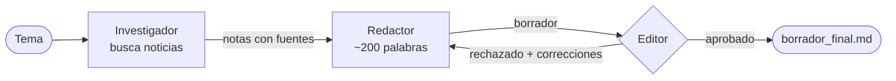

# crew-practices

Práctica de [CrewAI](https://docs.crewai.com/): un equipo de tres agentes que investiga un tema de actualidad, redacta un borrador de unas 200 palabras y lo somete a una revisión editorial con criterios concretos. Si el borrador no los cumple, vuelve al redactor. Todo corre sobre [Groq](https://groq.com/) en su capa gratuita.

El objetivo del repo es tener un ejemplo mínimo y funcional de tres cosas que suelen costar en CrewAI:

1. **Agentes con herramientas reales** (búsqueda web en vivo, sin API key).
2. **Un bucle de revisión** (redactor ⇄ editor), que CrewAI no trae resuelto entre tareas.
3. **Un LLM como revisor sin confiar ciegamente en él**: el código verifica por su cuenta el criterio medible (la longitud).

## Cómo funciona



| Agente | Qué hace | Herramienta |
|---|---|---|
| **Investigador** | Busca noticias de la última semana y devuelve entre 5 y 8 hechos con cifras, fechas y fuente (URL). | `buscar_noticias` (DuckDuckGo vía [`ddgs`](https://pypi.org/project/ddgs/)) |
| **Redactor** | Escribe un borrador de ~200 palabras usando solo las notas. | — |
| **Editor** | Verifica los criterios de edición y devuelve un veredicto en JSON con correcciones concretas. | `contar_palabras` |

**Criterios de edición** (constantes al inicio de [`main.py`](main.py)):

- Menciona al menos **2 datos concretos** (cifras, fechas, nombres) que figuren en las notas de investigación.
- No supera las **250 palabras**.

Si el editor rechaza, el redactor reescribe con esas correcciones y el editor vuelve a revisar, hasta **3 rondas**. Si tras la última ronda sigue sin aprobarse, el programa imprime el último borrador, avisa que quedó sin aprobar y termina con código de salida 1.

**Guarda de longitud.** Los LLM cuentan mal, y en las pruebas el editor aprobó borradores de 281 y 257 palabras. Por eso el código recalcula el conteo real y devuelve el borrador al redactor aunque el editor lo haya aprobado. El criterio de "2 datos concretos", en cambio, lo juzga solo el LLM. Más detalle en [docs/decisiones-tecnicas.md](docs/decisiones-tecnicas.md).

## Requisitos

- [uv](https://docs.astral.sh/uv/)
- Python 3.12 (el proyecto lo fija en [`.python-version`](.python-version); `crewai 1.15.20` declara `<3.14`)
- Una API key gratuita de Groq: <https://console.groq.com/keys>
- Acceso a internet (Groq, PyPI y DuckDuckGo)

## Instalación

```bash
cd crew_ai_practices
uv sync
cp .env.example .env
```

Editá `.env` y pegá tu key:

```
GROQ_API_KEY=gsk_...
```

`.env` está en `.gitignore`. No lo subas.

## Uso

```bash
uv run main.py "inteligencia artificial"
```

Sin argumento, el investigador elige por su cuenta un tema tecnológico de hoy:

```bash
uv run main.py
```

La salida muestra el trabajo de cada agente en vivo. Cuando el editor devuelve un borrador, se ve una línea como:

```
>>> Ronda 1: borrador devuelto al redactor (257 palabras). Motivo: Conteo real: 257 palabras ...
```

Al final se imprime el borrador aprobado y se guarda en `borrador_final.md`, con código de salida 0 si fue aprobado y 1 si no.

## Configuración

| Qué | Dónde | Por defecto |
|---|---|---|
| API key de Groq | `GROQ_API_KEY` en `.env` | — (obligatoria) |
| Modelo de Groq | `GROQ_MODEL` en `.env` | `qwen/qwen3.8-27b` |
| Tope de tokens de salida por respuesta | `GROQ_MAX_TOKENS` en `.env` | `900` |
| Longitud objetivo, máximo, mínimo de datos, rondas | constantes en [`main.py`](main.py) | 200 / 250 / 2 / 3 |

Para ver qué modelos ofrece tu cuenta de Groq:

```bash
curl -s https://api.groq.com/openai/v1/models -H "Authorization: Bearer $GROQ_API_KEY"
```

**Elegí el modelo con cuidado.** Los `openai/gpt-oss-*` de Groq fallan con el editor (ver [decisiones técnicas](docs/decisiones-tecnicas.md)). Si cambiás `GROQ_MODEL`, probá una corrida completa.

## Límites conocidos

- **Sin tests automáticos.** La verificación fue manual: tres corridas reales completas ("inteligencia artificial", "energía y clima" y "Jev"). Las dos primeras necesitaron una ronda de corrección; la tercera se aprobó en la primera.
- **El modo sin argumento no se probó.** Solo se corrió con un tema explícito.
- **Los datos no se verifican contra la fuente.** El editor coteja el borrador contra las *notas* del investigador, que son resúmenes de buscador. Un dato mal resumido en las notas pasa al borrador.
- **Dependencia de versiones exactas.** Los workarounds con Groq se observaron con `crewai 1.15.20` y `litellm 1.100.0`. Una versión posterior puede haberlos vuelto innecesarios o distintos.
- **Capa gratuita de Groq.** Los límites dependen de la cuenta y del modelo y pueden cambiar. Para `qwen/qwen3.8-27b`, el 21/09/2026 la API informó en sus cabeceras `x-ratelimit-*` 1000 peticiones y 8000 tokens por minuto, y además rechazó con un 429 los pedidos cuyo máximo de salida superaba **1000 tokens de salida por minuto** (ese límite no aparece en las cabeceras). Por eso el código fija `max_tokens=900`; si tu cuenta o modelo tienen otro límite, ajustá `GROQ_MAX_TOKENS`. Con un tope tan bajo, una respuesta larga podría cortarse. `max_rpm=20` es un tope prudente, no un valor derivado de un límite medido.
- **`litellm` sobra.** Quedó instalado por el extra `crewai[litellm]` que se usó al principio, pero el código ya no lo usa.

## Estructura

```
main.py                        # los tres agentes, las tareas y el bucle de revisión
.env.example                   # plantilla de configuración
pyproject.toml / uv.lock       # dependencias (uv)
docs/decisiones-tecnicas.md    # por qué el código es como es (problemas con Groq y CrewAI)
AGENTS.md                      # guía para agentes de código que trabajen en el repo
```

## Licencia

[MIT](LICENSE).
