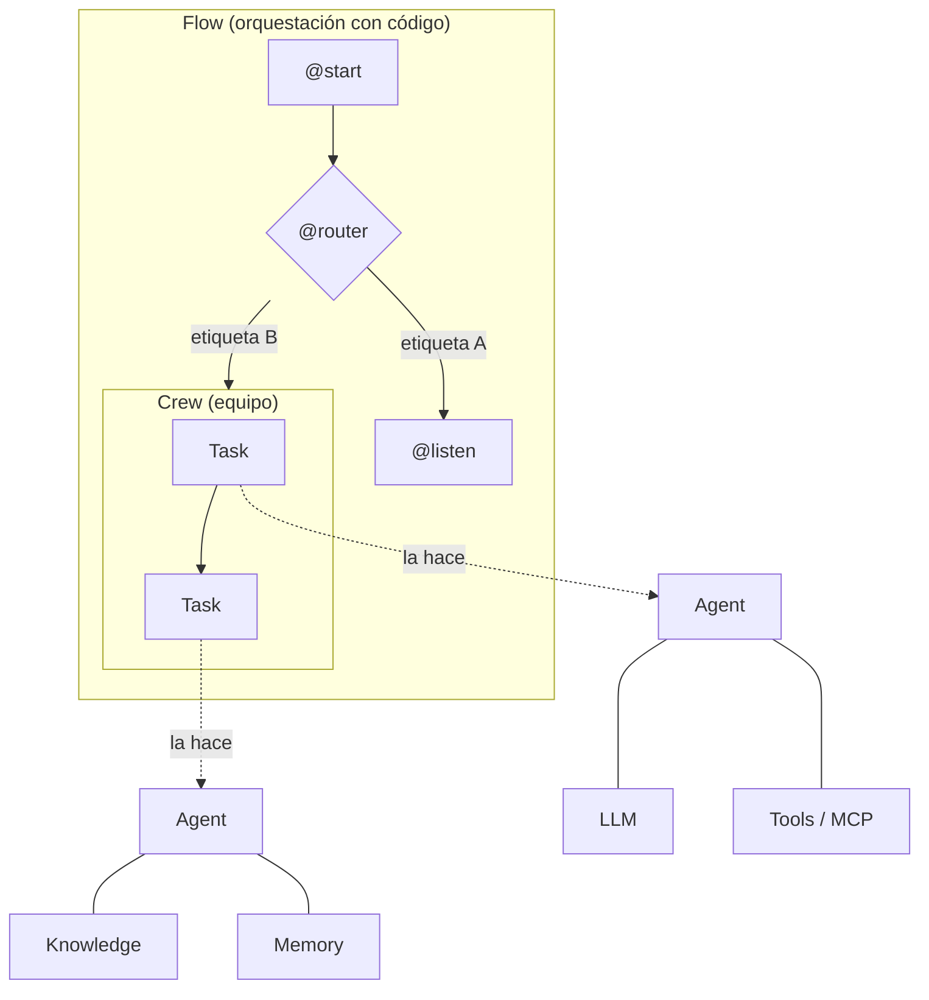

# Conceptos de CrewAI

Un glosario de todas las piezas que aparecen en el repo, con un ejemplo mínimo de cada una y un enlace al ejemplo completo. Si recién empezás, leelo en orden: cada concepto usa los anteriores.

## El mapa



De abajo hacia arriba: un **LLM** es el modelo de lenguaje. Un **Agent** le agrega un rol, un objetivo y herramientas. Una **Task** es un trabajo concreto para un agente. Un **Crew** ejecuta varias tareas con varios agentes. Un **Flow** encadena pasos de código, y cualquiera de esos pasos puede usar agentes o Crews.

---

## LLM

El modelo que "piensa". En CrewAI es un objeto `LLM` (o cualquier subclase de `BaseLLM`). En el repo siempre se crea con `crear_llm`, que elige el proveedor según `.env`:

```python
from comun import crear_llm
llm = crear_llm(0.2)  # temperatura: 0 = predecible, 1 = creativo
```

→ [proveedores-llm.md](proveedores-llm.md) · [05_proveedores_llm](../ejemplos/05_proveedores_llm)

## Agent (agente)

Un LLM con identidad. Tres textos definen cómo se comporta:

- `role`: quién es ("Bibliotecario").
- `goal`: qué busca lograr.
- `backstory`: su historia y estilo; acá van las reglas de conducta ("nunca inventa precios").

```python
from crewai import Agent
agente = Agent(role="Profesor", goal="Explicar sin jerga", backstory="Usa ejemplos cotidianos.", llm=llm)
agente.kickoff("¿Qué es una API?").raw
```

Un agente puede trabajar solo (`agente.kickoff(...)`) o dentro de un Crew. Por dentro repite un ciclo: piensa, usa una herramienta, observa el resultado, y así hasta dar una respuesta final (patrón ReAct). `max_iter` limita cuántas vueltas da.

→ [01_agentes/01_agente_solo](../ejemplos/01_agentes/01_agente_solo)

## Tool (herramienta)

Una función que el agente puede decidir llamar: buscar en la web, consultar una base, calcular. El LLM ve su **nombre**, su **descripción** (la docstring) y sus **argumentos**, y con eso decide cuándo usarla.

```python
from crewai.tools import tool

@tool("consultar_producto")
def consultar_producto(producto: str) -> str:
    """Devuelve precio y peso de un producto: teclado, mouse o monitor."""
    ...
```

Variantes: una subclase de `BaseTool` (argumentos validados con Pydantic, caché, límite de usos), `ToolFailure` para informar errores, y las herramientas listas de `crewai-tools`.

→ [01_agentes/02_herramientas](../ejemplos/01_agentes/02_herramientas)

## MCP (Model Context Protocol)

Un estándar para exponer herramientas desde **otro proceso**. El servidor MCP no sabe nada de CrewAI; cualquier cliente compatible (Claude Desktop, un IDE, CrewAI) puede usarlo.

```python
from crewai.mcp import MCPServerStdio
Agent(..., mcps=[MCPServerStdio(command="python", args=["servidor.py"])])
```

→ [01_agentes/03_mcp](../ejemplos/01_agentes/03_mcp)

## Knowledge (conocimiento, RAG)

Documentos propios (texto, PDF, CSV, JSON...) que el agente consulta antes de responder. CrewAI los divide en fragmentos, calcula sus **embeddings** y guarda todo en una base vectorial. Ante cada tarea busca los fragmentos más parecidos y los agrega al prompt. A esto se le llama RAG (*retrieval-augmented generation*).

```python
Agent(..., knowledge_sources=[TextFileKnowledgeSource(file_paths=[ruta])], embedder=config_embedder())
```

→ [01_agentes/04_knowledge](../ejemplos/01_agentes/04_knowledge)

## Embedding

La representación de un texto como un vector de números, en la que textos de significado parecido quedan cerca. Knowledge y memoria los usan para buscar por significado, no por palabras exactas. Los calcula un modelo de embeddings, que no es el mismo que el de chat. En el repo: `nomic-embed-text` en LM Studio.

## Memory (memoria)

Lo que el sistema recuerda **entre ejecuciones**. A diferencia de knowledge, que cargás vos, la memoria la escribe el propio sistema: un LLM decide qué guardar, con qué importancia y en qué *scope* (carpeta).

```python
memoria = Memory(llm=llm, embedder=config_embedder())
memoria.remember("Ana es vegetariana")
memoria.recall("¿qué come Ana?")
Crew(..., memory=memoria)  # los agentes recuerdan y guardan solos
```

→ [01_agentes/05_memoria](../ejemplos/01_agentes/05_memoria)

## Planning (planificación)

- **De un agente** (`planning_config`): antes de ejecutar su tarea, el agente escribe un plan de pasos y lo sigue.
- **De un Crew** (`planning=True`): antes de empezar, un planificador escribe un plan para cada tarea.

→ [01_agentes/06_planificacion](../ejemplos/01_agentes/06_planificacion) · [02_crews/06_planificacion](../ejemplos/02_crews/06_planificacion)

## Task (tarea)

Un trabajo concreto: qué hacer (`description`), cómo tiene que ser el resultado (`expected_output`) y quién lo hace (`agent`).

```python
from crewai import Task
Task(description="Escribí un haiku sobre {tema}", expected_output="Un haiku.", agent=poeta)
```

Opciones importantes:

| Parámetro | Para qué |
|---|---|
| `context=[otra_tarea]` | Recibir la salida de otras tareas |
| `output_pydantic=Modelo` | Salida estructurada ([08_salida_estructurada](../ejemplos/01_agentes/08_salida_estructurada)) |
| `guardrails=[...]` | Validar y pedir correcciones ([07_guardrails](../ejemplos/01_agentes/07_guardrails)) |
| `async_execution=True` | Correr en paralelo ([05_tareas_asincronas](../ejemplos/02_crews/05_tareas_asincronas)) |
| `human_input=True` | Pedir aprobación humana ([07_humano_en_el_bucle](../ejemplos/02_crews/07_humano_en_el_bucle)) |
| `callback=f` | Hacer algo al terminar ([03_callbacks](../ejemplos/04_observabilidad/03_callbacks)) |

`ConditionalTask` es una tarea que solo corre si la anterior cumple una condición ([04_tareas_condicionales](../ejemplos/02_crews/04_tareas_condicionales)).

## Guardrail

Un validador de la salida de una tarea. Devuelve `(True, valor)` o `(False, "motivo")`. Si falla, el agente recibe el motivo y reintenta. Puede ser una función de Python (determinista) o un texto (que evalúa un LLM).

→ [01_agentes/07_guardrails](../ejemplos/01_agentes/07_guardrails)

## Crew (equipo)

Agentes + tareas + un **proceso** que define el orden:

- `Process.sequential`: las tareas en el orden en que las listaste.
- `Process.hierarchical`: un manager (LLM) decide quién hace qué y revisa los resultados.

```python
from crewai import Crew, Process
crew = Crew(agents=[a, b], tasks=[t1, t2], process=Process.sequential)
salida = crew.kickoff(inputs={"tema": "el mate"})  # completa las {variables} de los textos
```

→ [02_crews](../ejemplos/02_crews)

## Delegación

Con `allow_delegation=True`, un agente recibe dos herramientas extra: "delegar trabajo" y "preguntarle a un compañero". Es el mecanismo que usa el manager del proceso jerárquico, pero también se puede activar en un Crew secuencial.

→ [02_crews/03_delegacion](../ejemplos/02_crews/03_delegacion)

## Flow

Un programa orientado a eventos: métodos de Python que se disparan entre sí. Da control total (ramas, bucles, estado, persistencia) y puede llamar a agentes y Crews desde cualquier paso.

| Decorador | Qué hace |
|---|---|
| `@start()` | Punto de entrada |
| `@listen(paso)` | Corre cuando `paso` termina y recibe lo que devolvió |
| `@router(paso)` | Devuelve una etiqueta que elige la rama siguiente |
| `@listen("etiqueta")` | Corre cuando un router emite esa etiqueta |
| `and_(a, b)` / `or_(a, b)` | Esperar a todos / al primero |
| `@persist()` | Guardar el estado para retomarlo |
| `@human_feedback(...)` | Pedir la opinión de una persona y rutear según la respuesta |

**Estado:** `self.state`, un dict o (mejor) un modelo Pydantic compartido por todos los pasos.

→ [03_flows](../ejemplos/03_flows)

## Crew vs. Flow: cuál usar

| | Crew | Flow |
|---|---|---|
| Quién decide el camino | Los agentes (más autonomía) | Tu código (más control) |
| Predecible | Menos | Más |
| Ramas y bucles | Limitados (`ConditionalTask`, jerárquico) | Nativos (`@router`) |
| Estado compartido | Salidas de tareas | `self.state` tipado |
| Ideal para | Trabajo creativo o abierto en una etapa | La aplicación completa, que llama a Crews en sus etapas |

La recomendación de CrewAI (y la del repo) es un **Flow como esqueleto** y **Crews o agentes en las etapas** que necesitan autonomía. Ver [03_flows/08_flow_con_crews](../ejemplos/03_flows/08_flow_con_crews) y [06_integrador](../ejemplos/06_integrador).

## Hooks, eventos y callbacks

Tres formas de engancharse a la ejecución:

| | Pueden modificar | Alcance | Ejemplo |
|---|---|---|---|
| **Hooks** | Sí: mensajes, respuestas, bloquear herramientas | Global (filtrable por agente o herramienta) | [01_hooks](../ejemplos/04_observabilidad/01_hooks) |
| **Eventos** | No: solo observan | Global (bus de eventos) | [02_eventos](../ejemplos/04_observabilidad/02_eventos) |
| **Callbacks** | Algunos (inputs y salida del Crew) | Un Crew o una tarea | [03_callbacks](../ejemplos/04_observabilidad/03_callbacks) |

## A2A (Agent-to-Agent)

Un protocolo abierto para que agentes de distintos frameworks, procesos o empresas se deleguen tareas por HTTP. Con `Agent(a2a=A2AClientConfig(endpoint=...))`, un agente de CrewAI puede delegar en uno remoto.

→ [01_agentes/10_a2a](../ejemplos/01_agentes/10_a2a)

## CrewBase y YAML

La forma "de proyecto" de definir un Crew: agentes y tareas en `config/agents.yaml` y `config/tasks.yaml`, y una clase decorada con `@CrewBase` que los arma. Es lo que genera `crewai create crew`.

→ [02_crews/08_proyecto_yaml](../ejemplos/02_crews/08_proyecto_yaml)
