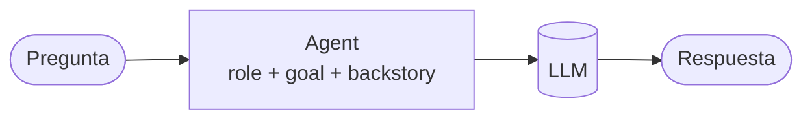

# 01 · Agente solo

> El agente más simple: un rol, un objetivo y un LLM, ejecutado con `kickoff()` sin Crew ni tareas.

## Qué vas a aprender

- Qué son `role`, `goal` y `backstory`, y cómo cambian las respuestas.
- Ejecutar un agente directamente con `Agent.kickoff()`.
- Pedir una respuesta **estructurada** (un objeto Pydantic) con `response_format`.
- Inyectar la fecha actual en el prompt con `inject_date=True`.

## Cómo funciona



CrewAI arma un prompt de sistema con el rol, el objetivo y la historia ("You are Profesor de tecnología. Docente de secundaria..."), agrega la pregunta y llama al LLM. Sin herramientas, es una sola llamada.

## El código clave

```python
agente = Agent(
    role="Profesor de tecnología",
    goal="Explicar conceptos técnicos a personas sin formación técnica",
    backstory="Docente de secundaria. Usa ejemplos cotidianos y evita la jerga.",
    llm=crear_llm(0.3),
    inject_date=True,
)

agente.kickoff("¿Qué es una API?").raw                                     # texto libre
agente.kickoff("Definí: agente de IA", response_format=Definicion).pydantic  # objeto Definicion
```

`response_format` recibe una clase Pydantic. CrewAI le pide al modelo esa estructura, valida la respuesta y la deja en `.pydantic`. Las `Field(description=...)` le explican al modelo qué poner en cada campo.

## Correrlo

```bash
uv run main.py agente_solo "¿Qué es una API?"
```

## Qué vas a ver

La salida real del 23/09/2026 con Groq (`qwen/qwen3.8-27b`), recortada:

```json
=== Respuesta estructurada (Pydantic) ===
{
  "termino": "agente de IA",
  "definicion": "Un agente de IA es un programa informático capaz de tomar decisiones y ejecutar acciones de forma autónoma para lograr un objetivo específico...",
  "ejemplo": "Imaginá que tenés un asistente virtual muy inteligente que no solo te responde preguntas, sino que puede abrir tu correo..."
}
```

Además de las respuestas, CrewAI imprime paneles ("LiteAgent Started", "Agent Final Answer"). Se controlan con `verbose`.

## Para experimentar

1. Cambiá el `backstory` a "Profesor universitario de sistemas, técnico y preciso" y compará la respuesta.
2. Subí la temperatura a 1.0 y corré dos veces la misma pregunta.
3. Agregá a `Definicion` un campo `nivel: Literal["básico", "intermedio", "avanzado"]`.

## Tests

`tests/test_agentes.py::TestAgenteSolo`: respuesta libre, respuesta estructurada y verificación de que la fecha llega al prompt.

## Ver también

- [02_herramientas](../02_herramientas): el siguiente paso, un agente que actúa.
- [08_salida_estructurada](../08_salida_estructurada): salida estructurada dentro de un Crew.
- [docs/conceptos.md#agent-agente](../../../docs/conceptos.md#agent-agente)
