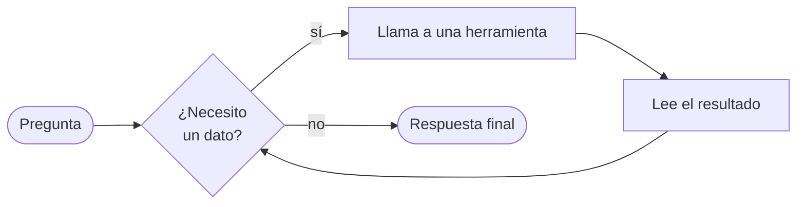

# 02 · Agente con herramientas

> Un agente que no solo habla: consulta un catálogo y calcula envíos llamando funciones de Python.

## Qué vas a aprender

- Las tres formas de crear herramientas: `@tool`, una subclase de `BaseTool` y el reporte de errores con `ToolFailure`.
- Validar argumentos con Pydantic (`args_schema`) y limitar usos (`max_usage_count`).
- Por qué la **descripción** de una herramienta decide si el agente la usa.

## Cómo funciona

El agente entra en un ciclo (patrón **ReAct**: razonar y actuar):



El LLM **no ejecuta** la herramienta: pide ejecutarla (nombre + argumentos), CrewAI la ejecuta en Python y le devuelve el resultado. `max_iter` pone un tope a las vueltas.

## El código clave

```python
@tool("consultar_producto")
def consultar_producto(producto: str) -> str | ToolFailure:
    """Devuelve el precio unitario (en pesos) y el peso (en kg) de un producto del catálogo.
    Los productos son genéricos, sin modelos: teclado, mouse, monitor."""
    if clave not in CATALOGO:
        return ToolFailure(message=f"'{producto}' no está en el catálogo...")
    ...

class CalcularEnvio(BaseTool):
    name: str = "calcular_envio"
    description: str = "Calcula el costo de envío en pesos según el peso total y la provincia."
    args_schema: type[BaseModel] = EntradaEnvio      # peso_kg > 0, provincia: str
    max_usage_count: int | None = 3

    def _run(self, peso_kg: float, provincia: str) -> str | ToolFailure: ...
```

| Forma | Cuándo usarla |
|---|---|
| `@tool` | Una función simple. El nombre sale del decorador y la descripción, de la docstring |
| `BaseTool` | Necesitás validar argumentos, estado propio, caché (`cache_function`) o límite de usos |
| `ToolFailure` | La herramienta "funcionó" pero no pudo hacer lo pedido. CrewAI lo registra como fallo (con evento y política configurable) en vez de tratarlo como un texto cualquiera |

## Correrlo

```bash
uv run main.py herramientas "¿Cuánto sale en total comprar 2 teclados y mandarlos a Córdoba?"
```

## Qué vas a ver

La salida real del 23/09/2026:

```
=== Presupuesto ===
Presupuesto para 2 teclados enviados a Córdoba:
- 2 × teclado: 2 × $25,000 = **$50,000**
- Envío (1.6 kg a Córdoba): **$4,480**
**Total: $54,480**
```

## Trampa: el agente puede no usar sus herramientas

En la primera versión la docstring decía solo "Devuelve el precio... de un producto del catálogo". El modelo **no llamó a ninguna herramienta** y respondió: *"En el catálogo tengo varios teclados (gaming, mecánicos, inalámbricos...). ¿Me decís cuál te interesa?"*. Inventó un catálogo.

Las herramientas sí se habían enviado; el modelo decidió no usarlas. Se resolvió así:

1. En la docstring, qué valores acepta ("teclado, mouse, monitor").
2. En la historia del agente, "antes de responder, consulta cada producto con `consultar_producto`".

Detalle en [trampas-conocidas.md §4](../../../docs/trampas-conocidas.md#4-el-modelo-no-usa-las-herramientas-que-tiene).

## Para experimentar

1. Preguntá por un "parlante" y mirá cómo el agente reacciona al `ToolFailure`.
2. Bajá `max_usage_count` a 1 y pedí envíos a dos provincias.
3. Agregá una herramienta `aplicar_cupon(codigo)` y un cupón "BIENVENIDA" con 10% de descuento.

## Tests

`tests/test_agentes.py::TestHerramientas` prueba cada herramienta sola y un agente (con LLM falso) que encadena las dos. Las herramientas se ejecutan de verdad.

## Ver también

- [03_mcp](../03_mcp): herramientas que viven en otro proceso.
- [04_observabilidad/01_hooks](../../04_observabilidad/01_hooks): interceptar y bloquear llamadas a herramientas.
- Herramientas listas para usar: `uv add "crewai[tools]"` instala `crewai-tools` (búsqueda web, lectura de archivos, scraping y más). No está instalado en este repo.
