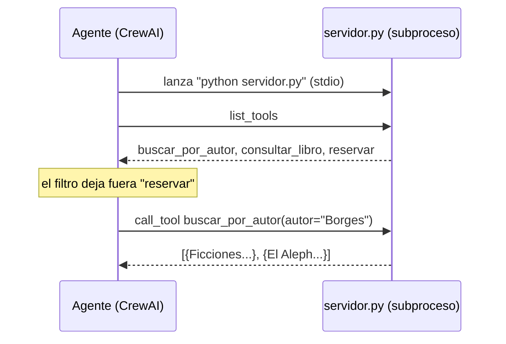

# 03 · Agente con MCP

> Las herramientas viven en un servidor aparte que habla el Model Context Protocol. CrewAI lo lanza, descubre sus herramientas y se las da al agente.

## Qué vas a aprender

- Qué es MCP y por qué conviene separar las herramientas del agente.
- Escribir un servidor MCP con `FastMCP` ([servidor.py](servidor.py)).
- Conectarlo con `Agent(mcps=[MCPServerStdio(...)])` y filtrar qué herramientas ve el agente.
- Dos trampas de `crewai 1.15.20` con MCP.

## Cómo funciona



El servidor no sabe nada de CrewAI: el mismo `servidor.py` lo podría usar Claude Desktop, un IDE u otro framework. Esa es la ventaja de MCP: escribís las herramientas una vez y las usa cualquier cliente.

| Transporte | Clase | Cuándo |
|---|---|---|
| stdio | `MCPServerStdio(command, args)` | Servidor local que CrewAI lanza como subproceso (este ejemplo) |
| HTTP | `MCPServerHTTP(url)` | Servidor remoto ya corriendo |
| SSE | `MCPServerSSE(url)` | Servidores con Server-Sent Events |

## El código clave

```python
# servidor.py
servidor = FastMCP("biblioteca")

@servidor.tool()
def buscar_por_autor(autor: str) -> str:
    """Lista los libros de un autor..."""
    return json.dumps(libros, ensure_ascii=False)   # un solo texto, no una lista (ver trampa 2)

# main.py
MCPServerStdio(
    command="python",
    args=[os.path.relpath(SERVIDOR)],               # camino corto (ver trampa 1)
    tool_filter=create_static_tool_filter(allowed_tool_names=["buscar_por_autor", "consultar_libro"]),
)
```

## Correrlo

```bash
uv run main.py mcp "¿Qué libros de Borges hay disponibles para llevar?"
```

Corrélo desde la raíz del repo: el camino al servidor es relativo.

## Qué vas a ver

```
Tool: python_ejemplos_01_agentes_03_mcp_servidor_py_buscar_por_autor
Output: [{"isbn": "978-950-07-0002", "titulo": "Ficciones", ... "disponible": false},
         {"isbn": "978-950-07-0003", "titulo": "El Aleph", ... "disponible": true}]

=== Respuesta ===
De los libros de **Jorge Luis Borges** que figuran en el catálogo, solo hay **uno disponible para llevar**:
- **El Aleph** (1949) — ISBN 978-950-07-0003 ✅ Disponible
```

También puede aparecer un `IncompleteFieldDefinitionWarning` de `pydantic_settings` (lo genera la librería `mcp`). Es inofensivo.

## Trampas

1. **Nombres truncados.** CrewAI nombra cada herramienta `"<comando>_<args>_<herramienta>"` y lo corta a 64 caracteres. Con `sys.executable` (un camino absoluto), la primera corrida mostró una herramienta llamada `users_mgobea_documents_crew_ai_practices_venv_bin_pytho_b5be08a4`. Se usa `command="python"` y un camino relativo.
2. **Solo se lee el primer bloque.** Con `-> list[dict]`, FastMCP manda un bloque por libro y CrewAI lee solo el primero: el agente respondió *"solo figura Ficciones"*. Se devuelve un único texto JSON.

Detalle en [trampas-conocidas.md §2 y §3](../../../docs/trampas-conocidas.md#2-herramientas-mcp-con-nombre-ilegible).

## Para experimentar

1. Llamá a `construir_agente(permitir_reservas=True)` y pedile que reserve "Bestiario".
2. Agregá al servidor una herramienta `libros_por_decada(decada: int)`.
3. Conectá el mismo servidor a otro cliente MCP (por ejemplo, Claude Desktop) y comprobá que funciona sin cambios.

## Tests

`tests/test_agentes.py::TestMCP`: la respuesta del servidor en un solo bloque, el largo de los nombres (< 64) y un agente con LLM falso que usa el **servidor MCP real** como subproceso.

## Ver también

- [Especificación de MCP](https://modelcontextprotocol.io)
- [02_herramientas](../02_herramientas): herramientas en el mismo proceso.
