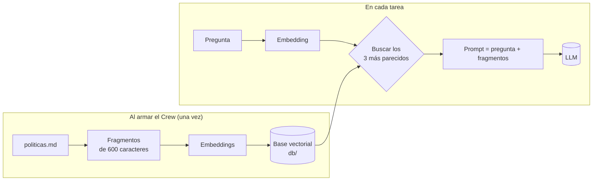

# 04 · Agente con knowledge (RAG)

> Un agente de atención al cliente que responde con las políticas internas de una tienda, un documento que el modelo nunca vio.

## Qué vas a aprender

- Qué es RAG (*retrieval-augmented generation*) y cómo lo implementa CrewAI.
- Fuentes de knowledge: archivos (`TextFileKnowledgeSource`) y texto en memoria (`StringKnowledgeSource`).
- Configurar un modelo de embeddings local (LM Studio) en vez de OpenAI.
- Por qué acá hace falta un Crew aunque haya un solo agente.

## Cómo funciona



El LLM no "aprende" el documento: en cada consulta recibe los fragmentos relevantes pegados en el prompt. Por eso funciona con documentos privados o recientes, y por eso la calidad depende de que la búsqueda encuentre el fragmento correcto.

## El código clave

```python
Agent(
    ...,
    knowledge_sources=[
        TextFileKnowledgeSource(file_paths=[DOCUMENTOS / "politicas.md"], chunk_size=600, chunk_overlap=60),
        StringKnowledgeSource(content="Teléfono de atención: 0800-555-TUERCA..."),
    ],
    embedder=config_embedder(),                                  # LM Studio local
    knowledge_config=KnowledgeConfig(results_limit=3, score_threshold=0.3),
)
# y se ejecuta dentro de un Crew (ver la trampa)
Crew(agents=[agente], tasks=[tarea]).kickoff()
```

| Parámetro | Efecto |
|---|---|
| `chunk_size` / `chunk_overlap` | Tamaño de cada fragmento y cuánto se solapan. Fragmentos chicos dan búsquedas precisas pero con poco contexto |
| `results_limit` | Cuántos fragmentos se agregan al prompt |
| `score_threshold` | Similitud mínima (0 a 1) para incluir un fragmento |

Otras fuentes disponibles: `PDFKnowledgeSource`, `CSVKnowledgeSource`, `JSONKnowledgeSource`, `ExcelKnowledgeSource` y `CrewDoclingSource`. Algunas requieren extras de `crewai`.

## Correrlo

Necesita el servidor de embeddings de LM Studio:

```bash
lms server start
uv run main.py knowledge "Compré un taladro hace 20 días y lo usé una vez. ¿Lo puedo devolver?"
```

La primera vez indexa el documento (unos segundos). La base queda en `db/`.

## Qué vas a ver

La salida real del 23/09/2026:

```
=== Respuesta ===
Hola. Lamentablemente, no es posible realizar la devolución. Según nuestra política, las herramientas
eléctricas que hayan sido utilizadas no se aceptan para devolución, salvo que se trate de una falla de
fábrica. Si el taladro presenta algún defecto, puedes consultar la garantía de 12 meses (o 18 meses si
tienes la tarjeta "Socio Tuerca") llamando al 0800-555-TUERCA.
```

Todo sale del documento: la regla de devolución, los 12/18 meses de garantía y el teléfono (que viene de la segunda fuente).

## Trampas

1. **`Agent.kickoff()` ignora el knowledge.** La primera versión usaba `agente.kickoff(pregunta)` y respondió *"no dispongo de la información sobre la política de devoluciones"*. En 1.15.20 el knowledge solo se indexa y consulta dentro de un Crew. [Detalle](../../../docs/trampas-conocidas.md#1-agentkickoff-ignora-knowledge_sources).
2. **Rutas relativas a `./knowledge/`.** Con un `str`, CrewAI busca el archivo en `./knowledge/` del directorio de trabajo. Por eso se pasa un `Path` absoluto. [Detalle](../../../docs/trampas-conocidas.md#15-rutas-de-archivos-de-knowledge-relativas-a-knowledge).
3. **Si cambiás el modelo de embeddings, borrá `db/`.**

## Para experimentar

1. Preguntá algo que no está en el documento ("¿hacen factura A?") y mirá si deriva al teléfono.
2. Subí `score_threshold` a 0.8 y repetí la pregunta del taladro.
3. Agregá un `politicas-2.md` con otra sección y sumalo a las fuentes.
4. Poné el knowledge en el Crew (`Crew(knowledge_sources=...)`) en vez de en el agente: así lo comparten todos los agentes.

## Tests

`tests/test_agentes.py::TestKnowledge`: que las fuentes apunten a archivos existentes y (con LM Studio encendido) que el fragmento correcto llegue al prompt del LLM.

## Ver también

- [05_memoria](../05_memoria): información que el sistema guarda solo, en vez de la que cargás vos.
- [docs/proveedores-llm.md#embeddings](../../../docs/proveedores-llm.md#embeddings-knowledge-y-memoria)
