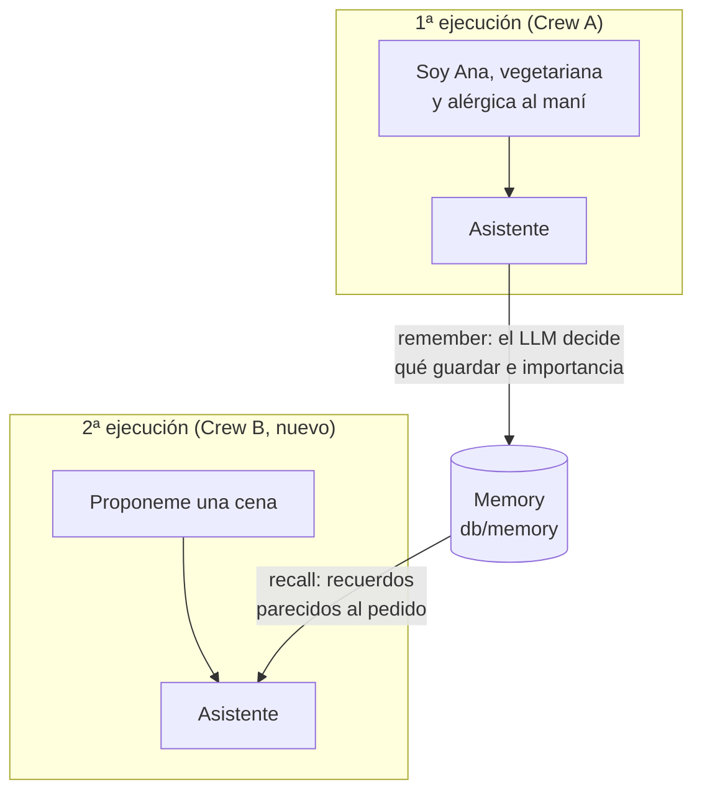

# 05 · Memoria

> Lo que se dijo en una ejecución queda disponible en las siguientes: un asistente que recuerda que Ana es vegetariana sin que se lo repita.

## Qué vas a aprender

- La diferencia entre **knowledge** (lo que cargás vos) y **memoria** (lo que el sistema guarda mientras trabaja).
- La API de `Memory`: `remember()`, `recall()`, `reset()`.
- Compartir una memoria entre Crews distintos con `Crew(memory=...)`.
- Recuerdo rápido (`depth="shallow"`) y profundo (`"deep"`).

## Cómo funciona



Cuando guardás algo, un LLM analiza el texto e infiere un *scope* (una ruta tipo carpeta, como `/customers/Juan_Pérez`), categorías y una importancia. Al recordar, se combinan similitud semántica, recencia e importancia.

## El código clave

```python
memoria = Memory(
    llm=crear_llm(0.0),              # analiza cada recuerdo
    embedder=config_embedder(),      # sin esto usa OpenAI y pide OPENAI_API_KEY
    root_scope="/ejemplos/memoria",
)

memoria.remember("Juan prefiere WhatsApp, nunca teléfono.")
memoria.recall("¿Cómo contacto a Juan?", limit=2, depth="shallow")

Crew(agents=[asistente], tasks=[tarea], memory=memoria)   # los agentes recuerdan y guardan solos
```

Con `memory=True`, CrewAI crea una memoria con el embedder del Crew y el LLM del primer agente.

## Correrlo

```bash
lms server start                    # embeddings locales
uv run main.py memoria --limpiar    # --limpiar borra la memoria antes de empezar
```

## Qué vas a ver

La salida real del 23/09/2026:

```
=== 1. API directa ===
> ¿Cómo contacto a Juan?
  [0.80] El cliente Juan Pérez prefiere que lo contacten por WhatsApp, nunca por teléfono.  (scope: /ejemplos/memoria/customers/Juan_Pérez)
  [0.77] Juan Pérez compró una amoladora en marzo y reclamó por el envío tardío.

=== 2. Crew con memoria: dos ejecuciones independientes ===
[1ª ejecución] ¡Hola, Ana! Anoté tus preferencias: vegetariana y alérgica al maní...
[2ª ejecución] Te propongo una cena rápida, deliciosa y 100% segura para vos (vegetariana y sin maní):
**Pasta al pesto de albahaca con tomates cherry y nueces** ...
```

La segunda ejecución es un Crew nuevo: lo único que comparte con el primero es la memoria.

## Observaciones

- Los *scopes* los infiere el LLM y a veces salen raros (se vio `/ejemplos/memoria/ejemplos/memoria/customers`). Si necesitás orden, pasá `scope=` explícito en `remember()`.
- Guardar cuesta una llamada al LLM por recuerdo (el análisis). `recall(depth="deep")` también usa el LLM; `shallow` solo usa embeddings.
- La memoria persiste en `db/memory` entre corridas. `memoria.reset()` la borra.

## Para experimentar

1. Corré el ejemplo dos veces sin `--limpiar` y mirá los recuerdos duplicados (o consolidados).
2. Usá `memoria.remember(..., private=True, source="ana")` y probá `recall` con y sin `source`.
3. Compará `depth="shallow"` y `depth="deep"` con una pregunta indirecta ("¿qué no le puedo servir a Ana?").

## Tests

`tests/test_agentes.py::TestMemoria` (con LM Studio): guardar y recuperar con scope explícito, usando un LLM falso.

## Ver también

- [04_knowledge](../04_knowledge)
- [03_flows/05_persistencia](../../03_flows/05_persistencia): guardar el **estado** de un proceso, que no es lo mismo que la memoria semántica.
