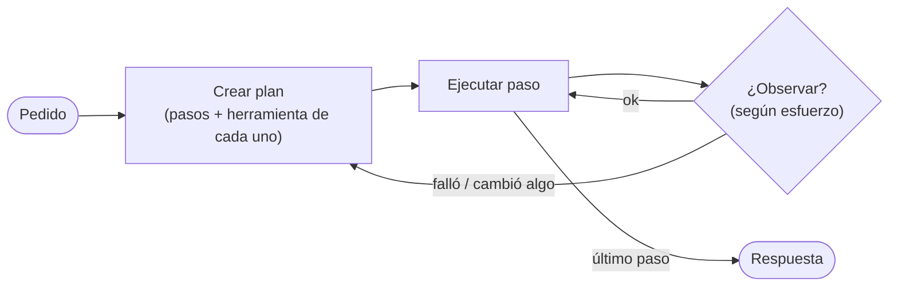

# 06 · Agente que planifica

> Antes de actuar, el agente escribe un plan de pasos. Después lo ejecuta y, según el esfuerzo configurado, lo revisa y corrige.

## Qué vas a aprender

- `planning_config=PlanningConfig(...)` y sus niveles de `reasoning_effort`.
- La diferencia con `reasoning=True` (deprecado) y con la planificación de un Crew.

## Cómo funciona



| `reasoning_effort` | Después de cada paso | Costo |
|---|---|---|
| `low` | No revisa con el LLM (heurística) | El menor |
| `medium` *(por defecto)* | Revisa; si un paso falla, re-planifica | Medio |
| `high` | Revisa y puede terminar antes, re-planificar o refinar el plan | El mayor |

## El código clave

```python
Agent(
    ...,
    tools=[temperatura_maxima],
    planning_config=PlanningConfig(reasoning_effort="low", max_steps=6),
)
```

Otros parámetros: `max_attempts` (intentos para refinar el plan), `llm` (un modelo distinto para planificar) y los prompts (`system_prompt`, `plan_prompt`, `refine_prompt`).

## Correrlo

```bash
uv run main.py planificacion           # esfuerzo "low"
uv run main.py planificacion high
```

## Qué vas a ver

El plan que generó el agente (23/09/2026), resumido:

```
Plan: Obtain the maximum temperature for each weekday of this week, identify which one is closest
to 21 °C, and explain the choice.
  1. Determine the dates of the weekdays (Mon–Fri)
  2. Call temperatura_maxima for each of the 5 weekdays        (tool_to_use: temperatura_maxima)
  3. Compute |T_max − 21| for each weekday and rank them
  4. Select the weekday with the smallest difference
  5. Produce the final answer in Spanish
```

Y la decisión: **martes** (22 °C, a 1 °C del objetivo), después de consultar los cinco días.

El plan sale en inglés porque los prompts internos de CrewAI están en inglés; la respuesta final sale en español ([trampas §17](../../../docs/trampas-conocidas.md#17-la-planificación-del-agente-sale-en-inglés)).

## ¿Cuándo conviene?

Cuando la tarea tiene varios pasos dependientes y un agente sin plan tiende a saltearse alguno (por ejemplo, decidir sin consultar todos los datos). Para una pregunta directa, solo suma latencia y tokens.

## Para experimentar

1. Compará `low` y `high` en tokens y tiempo.
2. Hacé que `temperatura_maxima` falle para "miércoles" y mirá si con `medium` el agente re-planifica.
3. Pasá un `plan_prompt` propio en español.

## Tests

`tests/test_agentes.py::TestPlanificacion`: la configuración y la herramienta.

## Ver también

- [02_crews/06_planificacion](../../02_crews/06_planificacion): planificar un Crew entero antes de empezar.
