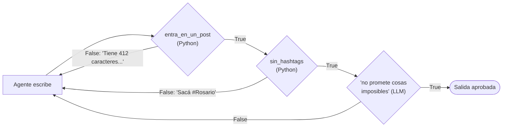

# 07 · Guardrails

> Validar la salida de una tarea y, si no cumple, devolvérsela al agente con el motivo para que la corrija.

## Qué vas a aprender

- Guardrails como **función de Python** (deterministas) y como **texto** (evaluados por un LLM).
- Encadenar varios guardrails en una lista.
- Transformar la salida desde el guardrail.

## Cómo funciona



Un guardrail recibe la `TaskOutput` y devuelve:

- `(True, valor)`: aprueba. `valor` reemplaza la salida (sirve para limpiarla).
- `(False, "motivo")`: rechaza. El agente recibe el motivo y vuelve a intentar, hasta `guardrail_max_retries` veces.

## El código clave

```python
def entra_en_un_post(salida: TaskOutput) -> tuple[bool, str]:
    texto = salida.raw.strip().strip('"')
    if len(texto) > MAX_CARACTERES:
        return False, f"Tiene {len(texto)} caracteres y el máximo es {MAX_CARACTERES}. Acortalo."
    return True, texto

Task(
    ...,
    guardrails=[
        entra_en_un_post,                                       # función
        sin_hashtags,                                           # función
        "El post no promete cosas imposibles de verificar",     # texto → LLMGuardrail
    ],
    guardrail_max_retries=3,
)
```

| Tipo | Ventajas | Desventajas | Usalo para |
|---|---|---|---|
| Función | Gratis, instantánea, siempre da lo mismo | Solo reglas que se puedan programar | Longitud, formato, palabras prohibidas, JSON válido |
| Texto (LLM) | Evalúa criterios subjetivos | Cuesta tokens y puede equivocarse | Tono, relevancia, promesas, datos sensibles |

Poné primero las funciones: si fallan, no se gasta la llamada al LLM.

## Correrlo

```bash
uv run main.py guardrails "el lanzamiento de una app de delivery en bicicleta en Rosario"
```

## Qué vas a ver

La salida real del 23/09/2026, aprobada al primer intento:

```
=== Post aprobado (132 caracteres) ===
Rosario, este cambió las reglas. 🚲🔥
Tu pedido llega rápido, fresco y sin humo. La nueva app ya está a un toque. Pedí y disfrutá. 🍔⚡
```

Si el modelo cumple de entrada, no vas a ver reintentos. Para verlos, bajá `MAX_CARACTERES` a 80. El test offline sí fuerza el ciclo completo: un texto demasiado largo, después uno con hashtag y al final uno válido.

## Guardrail en un agente

También existe `Agent(guardrail=..., guardrail_max_retries=...)`, que valida la salida de `agente.kickoff()` sin Crew. La función recibe la salida del agente en vez de una `TaskOutput`.

## Para experimentar

1. `MAX_CARACTERES = 80` y mirá los reintentos en la terminal.
2. Agregá un guardrail que exija terminar con una pregunta.
3. Hacé un guardrail que reemplace malas palabras en vez de rechazar (devolviendo `True` y el texto limpio).

## Tests

`tests/test_agentes.py::TestGuardrails`: el agente (con LLM falso) falla dos guardrails, recibe los motivos y la tercera respuesta pasa, incluido el `LLMGuardrail`.

## Ver también

- La guarda de longitud del [integrador](../../06_integrador/01_redactor_editor): la misma idea, implementada con un bucle en Python.
