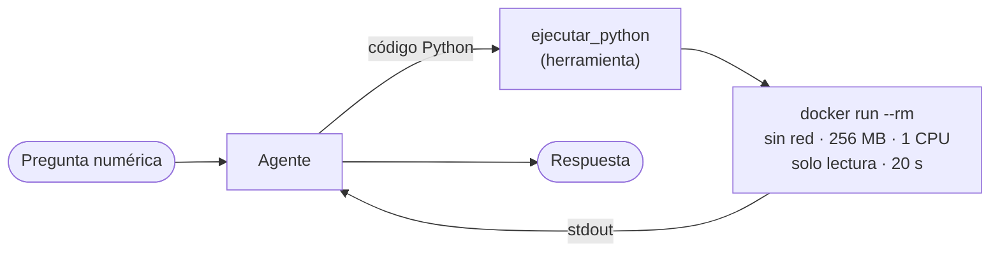

# 09 · Agente que ejecuta código

> Para cálculos exactos el agente no estima: escribe un programa, lo ejecuta en un contenedor Docker aislado y reporta el resultado.

## Qué vas a aprender

- Por qué `allow_code_execution=True` ya no es el camino en 1.15.
- Construir un sandbox con una herramienta propia y Docker.
- Qué límites ponerle a código generado por un LLM.

## Contexto

| Versión de CrewAI | Cómo se ejecutaba código |
|---|---|
| 0.x | `Agent(allow_code_execution=True)` + `CodeInterpreterTool` |
| 1.15 | Ese parámetro está **deprecado** y `CodeInterpreterTool` ya no existe. CrewAI recomienda sandboxes dedicados (E2B, Modal...) |

Este ejemplo arma el sandbox más simple posible con Docker, que ya tenés localmente.

## Cómo funciona



## El código clave

```python
comando = [
    "docker", "run", "--rm", "-i",
    "--network", "none",          # sin internet
    "--memory", "256m", "--cpus", "1", "--pids-limit", "64",
    "--read-only",                # no puede escribir en el disco del contenedor
    "--entrypoint", "python", IMAGEN, "-",
]
subprocess.run(comando, input=codigo, capture_output=True, text=True, timeout=20)
```

Si el programa falla, la herramienta devuelve un `ToolFailure` con el error: el agente lo lee y puede corregir su código.

> **Nunca** ejecutes código generado por un LLM con `exec()` ni en tu máquina directamente. El modelo puede equivocarse y, si procesa texto de terceros, puede ser manipulado (*prompt injection*).

## Correrlo

Necesita Docker encendido. La primera vez descarga `python:3.12-slim` (~50 MB). Podés usar otra imagen con Python con `SANDBOX_IMAGEN` en `.env`.

```bash
uv run main.py ejecucion_de_codigo "¿Cuántos números primos hay entre 1 y 10.000, y cuál es el más grande?"
```

## Qué vas a ver

La salida real del 23/09/2026:

```
Output: Cantidad de primos entre 1 y 10000: 1229
        Primo más grande: 9973

=== Respuesta ===
- **Cantidad de números primos entre 1 y 10.000:** **1.229**
```

Los dos valores son correctos. Un LLM "de memoria" suele errar este tipo de cuentas.

## Para experimentar

1. Pedí algo que necesite internet ("descargá la cotización del dólar") y mirá el error de red.
2. Pedí un bucle infinito y comprobá el corte a los 20 segundos.
3. Agregá la posibilidad de pasarle un CSV montándolo en solo lectura (`-v archivo.csv:/datos.csv:ro`).

## Tests

`tests/test_agentes.py::TestEjecucionDeCodigo`: el error se informa como `ToolFailure` y (si Docker está disponible) el contenedor ejecuta código y **no tiene red**.

## Ver también

- [02_herramientas](../02_herramientas): `ToolFailure` y herramientas propias.
- [trampas §12](../../../docs/trampas-conocidas.md#12-el-llm-se-equivoca-en-datos-del-dominio): por qué conviene calcular con código en vez de confiar en el modelo.
