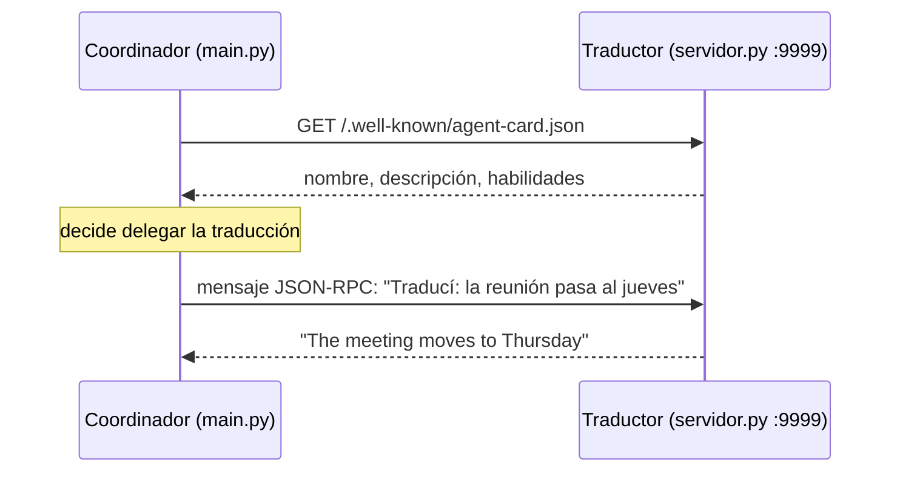

# 10 · Agente remoto con A2A

> Un agente de CrewAI que delega trabajo en otro agente que corre en otro proceso (u otra empresa), usando el protocolo abierto Agent-to-Agent.

> ⚠️ **No verificado.** Este ejemplo necesita el extra `crewai[a2a]` (el paquete `a2a-sdk`), que no se pudo instalar en el entorno donde se armó el repo (sin acceso a PyPI). El código sigue la API de `crewai 1.15.20` (cliente) y de `a2a-sdk 0.3` (servidor), pero **nunca se ejecutó**. Si lo corrés, contanos qué pasó.

## Qué vas a aprender

- Qué problema resuelve A2A y en qué se diferencia de MCP.
- Configurar un agente cliente con `A2AClientConfig`.
- Exponer un agente de CrewAI como servidor A2A con `a2a-sdk`.

## MCP vs. A2A

| | MCP | A2A |
|---|---|---|
| Qué expone | **Herramientas** (funciones) | **Agentes** (con su propio razonamiento) |
| Quién decide | Tu agente decide cada llamada | El agente remoto resuelve la tarea a su manera |
| Conversación | Una llamada, una respuesta | Puede tener varios turnos |
| Descubrimiento | `list_tools` | Una *agent card* en `/.well-known/agent-card.json` |

## Cómo funciona



## El código clave

Cliente ([main.py](main.py)):

```python
from crewai.a2a import A2AClientConfig
Agent(..., a2a=A2AClientConfig(endpoint="http://localhost:9999/.well-known/agent-card.json",
                               timeout=60, max_turns=3, fail_fast=True))
```

Servidor ([servidor.py](servidor.py)): un `AgentExecutor` de `a2a-sdk` que, al recibir un mensaje, llama a `agente.kickoff_async(...)` de CrewAI y devuelve el texto. CrewAI 1.15 trae el cliente, pero no un servidor fuera de su plataforma AMP (`A2AServerConfig` describe la *agent card* para AMP).

## Correrlo

```bash
uv add "crewai[a2a]"
uv run python ejemplos/01_agentes/10_a2a/servidor.py                                           # terminal 1
uv run main.py a2a "Mandale al equipo de Londres: la reunión del martes pasa al jueves a las 15"  # terminal 2
```

Sin el extra, `main.py` avisa y sale con código 2:

```
Falta el extra de A2A. Instalalo con: uv add "crewai[a2a]"
```

## Para experimentar

1. Reemplazá el traductor por un agente hecho con otro framework que hable A2A.
2. Agregá `response_model=` al `A2AClientConfig` para recibir una respuesta estructurada.

## Tests

`tests/test_agentes.py::TestA2A`: sin el extra, el ejemplo avisa y sale con código 2. No hay test del flujo completo.

## Ver también

- [Protocolo A2A](https://a2a-protocol.org)
- [03_mcp](../03_mcp)
