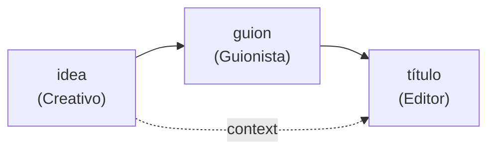

# 01 · Crew secuencial

> Tres agentes en cadena (creativo → guionista → editor de títulos) producen un video corto. Cada tarea recibe lo que hicieron las anteriores.

## Qué vas a aprender

- `Process.sequential`: el proceso por defecto.
- Cómo viaja el contexto entre tareas, de forma automática y con `context=[...]`.
- Leer la salida de cada tarea y el consumo de tokens.

## Cómo funciona



- Sin `context`, cada tarea recibe la salida de la **inmediatamente anterior**.
- Con `context=[idea, guion]`, recibe exactamente esas (pueden ser varias y no consecutivas).

## El código clave

```python
titulo = Task(description="Escribí 3 títulos posibles para el video.",
              expected_output="Una lista de 3 títulos de menos de 60 caracteres.",
              agent=editor, context=[idea, guion])

Crew(agents=[creativo, guionista, editor], tasks=[idea, guion, titulo], process=Process.sequential)
```

## Correrlo

```bash
uv run main.py secuencial "cómo ahorrar agua en casa"
```

## Qué vas a ver

El final de la salida real del 23/09/2026:

```
=== Editor de títulos ===
1. Tu grifo está robando dinero
2. Deja de perder dinero por una gota
3. Ese grifo gotea tu bolsillo

Tokens usados: 2925
```

## Para experimentar

1. Quitá `context=[idea, guion]` del título y compará: ahora solo ve el guion.
2. Agregá una cuarta tarea "hashtags" que solo reciba el título.
3. Cambiá la temperatura del creativo a 1.0.

## Tests

`tests/test_crews.py::TestSecuencial`: la tercera llamada al LLM recibe la idea y el guion.
