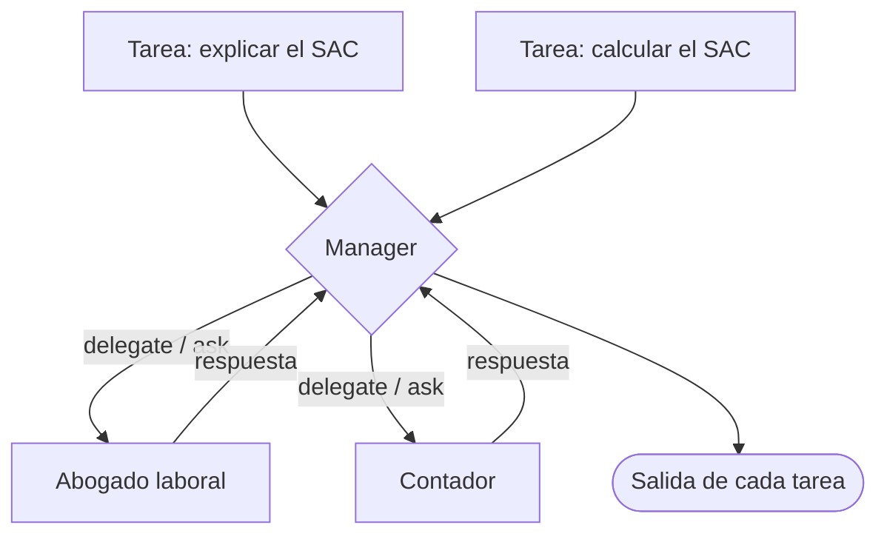

# 02 · Crew jerárquico

> Un manager recibe las tareas, decide qué especialista hace cada una (un abogado laboral o un contador), revisa el resultado y arma la respuesta.

## Qué vas a aprender

- `Process.hierarchical` con un manager genérico (`manager_llm`) o propio (`manager_agent`).
- Por qué las tareas no llevan `agent`.
- Los costos y riesgos de dejar que un LLM coordine.

## Cómo funciona



El manager recibe dos herramientas: **Delegate work to coworker** y **Ask question to coworker** (en los logs aparecen como `delegate_work_to_coworker` y `ask_question_to_coworker`).

## El código clave

```python
Crew(agents=[abogado, contador], tasks=tareas, process=Process.hierarchical,
     manager_llm=crear_llm(0.0))

# o con un manager a medida:
Crew(..., process=Process.hierarchical,
     manager_agent=Agent(role="Coordinador de consultas", ..., allow_delegation=True))
```

## Correrlo

```bash
uv run main.py jerarquico
uv run main.py jerarquico --manager-propio
```

## Lo que pasó en las corridas reales

Este ejemplo dejó tres lecciones (23/09/2026):

1. **La delegación funciona:** el manager consultó al contador con `ask_question_to_coworker` varias veces.
2. **El dominio falla sin reglas.** El "contador" calculó el aguinaldo como `$900.000 ÷ 12 = $75.000`. Lo correcto es `÷ 2 = $450.000`. Además afirmó que el SAC no tiene aportes, lo cual es falso. Por eso la regla ahora está en la historia del contador ([trampas §12](../../../docs/trampas-conocidas.md#12-el-llm-se-equivoca-en-datos-del-dominio)).
3. **Es caro.** En una corrida, el manager y los trabajadores se consultaron tantas veces que el contexto superó el límite de Groq de 7000 tokens de entrada por minuto (error 413) ([trampas §11](../../../docs/trampas-conocidas.md#11-límites-de-groq-entrada-por-minuto-413-y-tokens-por-día-429)). La versión con la regla corregida no se volvió a correr en vivo, porque se agotó la cuota diaria.

## ¿Cuándo conviene?

Cuando no sabés de antemano qué especialista necesita cada pedido y aceptás pagar más tokens por esa flexibilidad. Si la asignación es predecible, un Crew secuencial o un Flow con `@router` ([03_flows/07](../../03_flows/07_flow_con_agentes)) es más barato y confiable.

## Para experimentar

1. Agregá una tarea que no corresponda a ningún especialista ("¿qué hora es en Tokio?") y mirá qué hace el manager.
2. Compará el consumo de tokens con una versión secuencial de las mismas tareas.

## Tests

`tests/test_crews.py::TestJerarquico`: la configuración de los dos tipos de manager y una delegación guionada en la que el manager consulta al contador y usa su respuesta.
