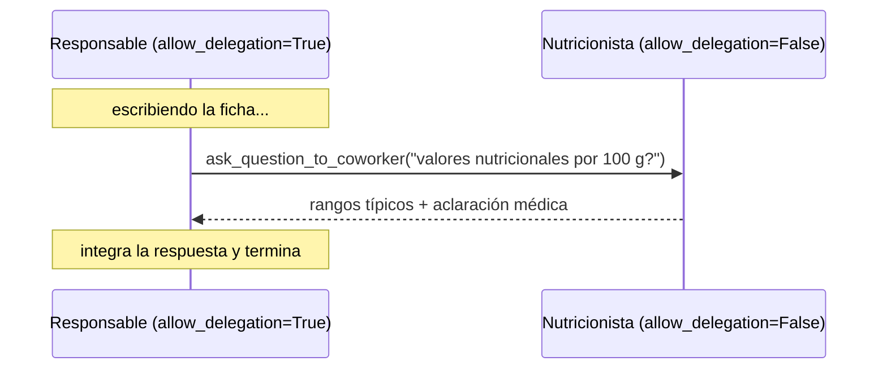

# 03 · Delegación entre agentes

> El responsable de producto escribe la ficha de una granola, pero la parte nutricional se la consulta a la nutricionista, por su cuenta y sin manager.

## Qué vas a aprender

- `allow_delegation=True` y las dos herramientas que agrega.
- Cómo evitar que dos agentes se devuelvan el trabajo entre ellos.

## Cómo funciona



| Herramienta | Para qué |
|---|---|
| `Delegate work to coworker` | Pasarle una subtarea completa a otro agente |
| `Ask question to coworker` | Hacerle una pregunta puntual |

El proceso sigue siendo **secuencial**; la delegación ocurre dentro de la tarea.

## El código clave

```python
responsable = Agent(..., backstory="No es experto en nutrición: cualquier dato nutricional se lo consulta a la nutricionista.",
                    allow_delegation=True)
nutricionista = Agent(..., allow_delegation=False)   # evita el ping-pong
```

La historia del responsable le dice **cuándo** delegar. Sin esa pista, el modelo suele resolver todo solo.

## Correrlo

```bash
uv run main.py delegacion
```

## Qué vas a ver

En los logs, `Tool: ask_question_to_coworker` con la pregunta del responsable, y en la ficha final un apartado nutricional (23/09/2026):

```
## 📊 APARTADO NUTRICIONAL
> **Valores medios por 100 g de producto**
| **Energía** | **450 kcal / 1 880 kJ** |
| **Proteínas** | **10 g** |
...
```

## Para experimentar

1. Sacá la frase de la historia del responsable y mirá si sigue delegando.
2. Poné `allow_delegation=True` en los dos agentes y observá los riesgos.

## Tests

`tests/test_crews.py::TestDelegacion`: solo el responsable puede delegar.

## Ver también

- [02_jerarquico](../02_jerarquico): la delegación como mecanismo central.
