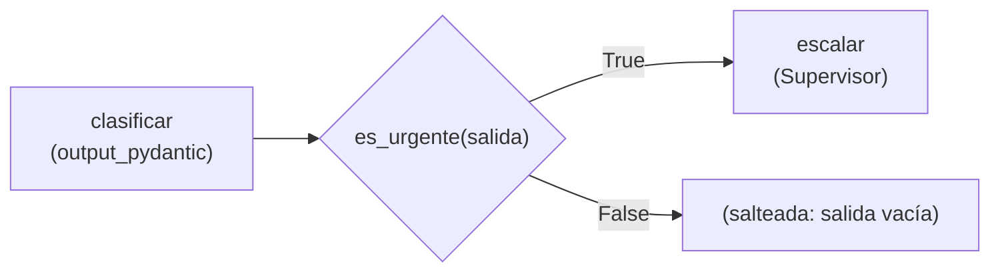

# 04 · Tareas condicionales

> Un operador clasifica un reclamo a la distribuidora eléctrica. Solo si es urgente, un supervisor redacta la orden para la cuadrilla.

## Qué vas a aprender

- `ConditionalTask(condition=funcion)`.
- Combinarla con una salida estructurada para que la condición sea confiable.

## Cómo funciona



La condición es una función de Python que recibe la `TaskOutput` de la tarea anterior. Como la clasificación es un objeto Pydantic, la condición lee un booleano en vez de buscar la palabra "urgente" en un texto.

## El código clave

```python
def es_urgente(salida: TaskOutput) -> bool:
    return bool(salida.pydantic and salida.pydantic.urgente)

clasificar = Task(..., output_pydantic=Clasificacion)
escalar = ConditionalTask(description="Redactá la orden...", expected_output="...",
                          agent=supervisor, condition=es_urgente)
```

Reglas: una `ConditionalTask` no puede ser la primera tarea ni la única del Crew.

## Correrlo

```bash
uv run main.py condicionales "Se me cortó la luz y tengo un respirador artificial en casa"
uv run main.py condicionales "Quiero cambiar la fecha de vencimiento de mi factura"
```

## Qué vas a ver

Salidas reales del 23/09/2026:

```
=== Clasificación ===
categoria='Corte de energía' urgente=True motivo='Riesgo para la vida por dependencia de respirador artificial'
=== Escalamiento ===
PRIORIDAD: URGENTE - RIESGO VITAL ...
```

```
=== Clasificación ===
categoria='Administrativo' urgente=False motivo='Solicitud de cambio de fecha de vencimiento de factura'
=== Escalamiento ===
(no se ejecutó: no es urgente)
```

## Para experimentar

1. Agregá una segunda condicional para reclamos de facturación.
2. Reemplazá el Crew por un Flow con `@router` ([03_flows/03_router](../../03_flows/03_router)) y compará: ¿cuál se lee mejor con tres o más ramas?

## Tests

`tests/test_crews.py::TestCondicionales`: con un reclamo urgente la tarea corre, y con uno que no lo es se saltea **sin llamar al LLM**.
