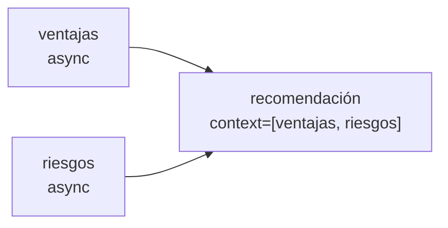

# 05 · Tareas asíncronas

> Un analista optimista y uno de riesgos trabajan **al mismo tiempo**; cuando los dos terminan, el director decide.

## Qué vas a aprender

- `async_execution=True` para tareas independientes.
- Cómo `context=[...]` sincroniza: la tarea que depende espera a las que lista.

## Cómo funciona



Con `async_execution=True`, el Crew lanza la tarea y sigue con la próxima sin esperar. La tarea que tiene `context=[ventajas, riesgos]` espera a que ambas terminen. El tiempo total se acerca al de la tarea más lenta, no a la suma de las dos.

## El código clave

```python
ventajas = Task(..., agent=optimista, async_execution=True)
riesgos = Task(..., agent=pesimista, async_execution=True)
recomendacion = Task(..., agent=director, context=[ventajas, riesgos])
```

## Correrlo

```bash
uv run main.py asincronas "migrar el sistema de facturación a la nube"
```

Muestra el tiempo total. Para comparar, quitá `async_execution=True` y volvé a correrlo.

> No se verificó en vivo: se agotó la cuota diaria de Groq antes de correrlo. El test offline sí verifica el paralelismo y la sincronización.

## Para experimentar

1. Agregá un tercer analista asíncrono ("costos").
2. Poné dos tareas asíncronas seguidas **al final** del Crew: CrewAI lo rechaza al construirlo con `The crew must end with at most one asynchronous task.`

## Tests

`tests/test_crews.py::TestAsincronas`: las dos primeras tareas son asíncronas y la recomendación recibe las dos salidas.

## Ver también

- [03_flows/04_paralelo_and_or](../../03_flows/04_paralelo_and_or): paralelismo en Flows con `and_` y `or_`.
