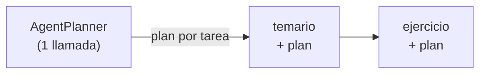

# 06 · Crew con planificación

> Antes de arrancar, un planificador lee todas las tareas del Crew y le agrega a cada una un plan paso a paso.

## Qué vas a aprender

- `Crew(planning=True, planning_llm=...)`.
- La diferencia con la planificación de un agente.

## Cómo funciona



El planificador devuelve un plan por tarea, y CrewAI lo **agrega al final de la descripción** de cada una. Después el Crew corre normalmente.

| | `Crew(planning=True)` | `Agent(planning_config=...)` ([01_agentes/06](../../01_agentes/06_planificacion)) |
|---|---|---|
| Qué planifica | Todas las tareas del Crew, una vez, al inicio | Los pasos de un agente dentro de su tarea |
| Re-planifica | No | Según `reasoning_effort` |
| Costo | Una llamada extra al inicio | Una o más por tarea |

## El código clave

```python
Crew(agents=[docente], tasks=[temario, ejercicio], planning=True, planning_llm=crear_llm(0.0))
```

Sin `planning_llm`, CrewAI usa un modelo de OpenAI por defecto y pide `OPENAI_API_KEY`. Por eso se pasa siempre.

## Correrlo

```bash
uv run main.py 02_crews/06_planificacion
```

El ejemplo imprime la descripción final de la primera tarea, para que veas el plan agregado.

> No se verificó en vivo: se agotó la cuota diaria de Groq. El test offline sí verifica que el plan se agregue a cada tarea.

## Para experimentar

1. Corré con y sin `planning=True` y compará la coherencia entre temario y ejercicio.
2. Usá un modelo más grande como `planning_llm` y uno chico para el docente.

## Tests

`tests/test_crews.py::TestPlanificacionDelCrew`: con un planificador guionado, cada tarea termina con su plan en la descripción.
