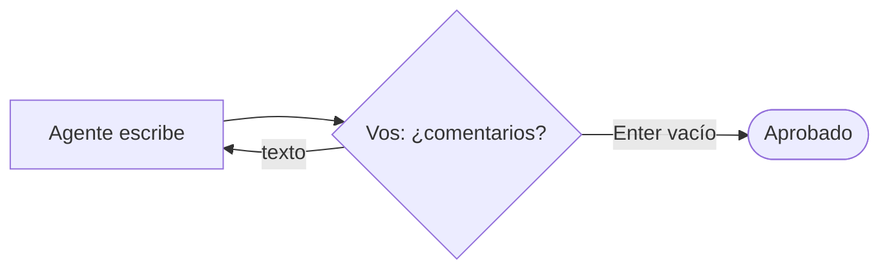

# 07 · Humano en el bucle

> El agente redacta un mensaje, te lo muestra y espera tu opinión. Si escribís una corrección, lo rehace; con Enter vacío, lo aprueba.

## Qué vas a aprender

- `Task(human_input=True)`.
- Cuándo alcanza esto y cuándo conviene `@human_feedback` en un Flow.

## Cómo funciona



## El código clave

```python
Task(description=f"Escribí este mensaje: {pedido}", expected_output="...", agent=redactor, human_input=True)
```

## Correrlo

Es interactivo: corrélo en una terminal.

```bash
uv run main.py humano_en_el_bucle "invitación al asado de fin de año de la oficina, viernes 12/12 a las 20"
```

Cuando aparezca el borrador, escribí por ejemplo "más corto y sin emojis", o apretá Enter para aprobarlo.

## `human_input` vs. `@human_feedback`

| | `Task(human_input=True)` | `@human_feedback` en un Flow ([03_flows/06](../../03_flows/06_human_feedback)) |
|---|---|---|
| Dónde pregunta | Terminal | Terminal o un proveedor propio (Slack, web, mail) |
| Qué hace con la respuesta | El agente rehace la tarea | Un LLM la clasifica en etiquetas que eligen la rama siguiente |
| Pausa y retoma más tarde | No | Sí (proveedores asíncronos + persistencia) |

## Tests

`tests/test_crews.py::TestHumanoEnElBucle` reemplaza `input()` con `mock.patch`: la primera respuesta es una corrección, que llega al prompt del agente, y la segunda es Enter.
