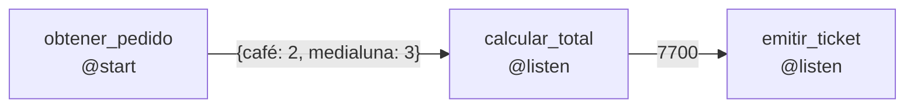

# 01 · Flow básico

> Tres pasos encadenados (tomar el pedido, calcular el total, emitir el ticket) sin ningún LLM.

## Qué vas a aprender

- `@start()`: el punto de entrada.
- `@listen(metodo)`: correr cuando otro método termina y recibir lo que devolvió.
- Que un Flow no necesita agentes.

## Cómo funciona



El valor que devuelve un método llega como argumento a los que lo escuchan. `kickoff()` devuelve lo que retornó el último método ejecutado.

## El código clave

```python
class FlowPedido(Flow):
    @start()
    def obtener_pedido(self) -> dict[str, int]:
        return {"café": 2, "medialuna": 3}

    @listen(obtener_pedido)
    def calcular_total(self, pedido: dict[str, int]) -> int:
        return sum(PRECIOS[p] * c for p, c in pedido.items())

    @listen(calcular_total)
    def emitir_ticket(self, total: int) -> str:
        return f"Total a pagar: ${total:,}".replace(",", ".")
```

## Correrlo

```bash
uv run main.py flows/01_basico
```

## Qué vas a ver

```
=== Resultado ===
Total a pagar: $7.700
```

CrewAI también imprime paneles de "Flow Started", "Method Execution" y demás, que muestran cada paso.

## Para experimentar

1. Agregá un segundo `@listen(calcular_total)` que imprima si el total supera $5.000. ¿En qué orden corren?
2. Llamá a `FlowPedido().plot()` y abrí el HTML que genera.

## Tests

`tests/test_flows.py::TestFlowBasico`.
