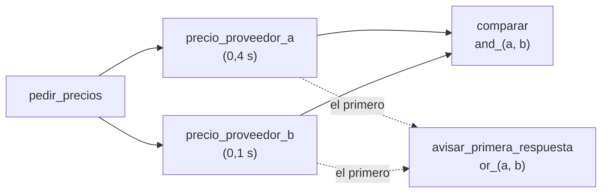

# 04 · Pasos en paralelo, `and_` y `or_`

> Pedir precio a dos proveedores al mismo tiempo, avisar apenas responde el primero y comparar cuando respondieron los dos.

## Qué vas a aprender

- Que varios `@listen` sobre el mismo paso se disparan juntos (en paralelo si son `async`).
- `and_(a, b)`: esperar a todos.
- `or_(a, b)`: disparar con el primero.

## Cómo funciona



## El código clave

```python
@listen(pedir_precios)
async def precio_proveedor_a(self):
    await asyncio.sleep(0.4)
    ...

@listen(or_(precio_proveedor_a, precio_proveedor_b))
def avisar_primera_respuesta(self): ...

@listen(and_(precio_proveedor_a, precio_proveedor_b))
def comparar(self) -> str: ...
```

Para que haya paralelismo real, los pasos tienen que ser `async` y esperar con `await`. Si son funciones comunes que bloquean (por ejemplo, `time.sleep`), corren uno después del otro.

## Correrlo

```bash
uv run main.py paralelo_and_or
```

## Qué vas a ver

```
Eventos: pedido enviado → respondió B → primera respuesta: B → respondió A → comparación hecha
Resultado: Conviene el proveedor A ($15,000)
Duración de los pasos: 0.41 s
```

- `or_` se disparó con B, que tarda menos.
- `and_` esperó a A.
- 0,41 s: los dos corrieron a la vez (en serie serían 0,5 s).

## Para experimentar

1. Cambiá `asyncio.sleep` por `time.sleep` y mirá la duración.
2. Agregá un proveedor C con un `sleep` de 2 s y un `and_` de los tres.

## Tests

`tests/test_flows.py::TestParaleloAndOr`: el orden de los eventos y que la duración sea menor a la suma.
