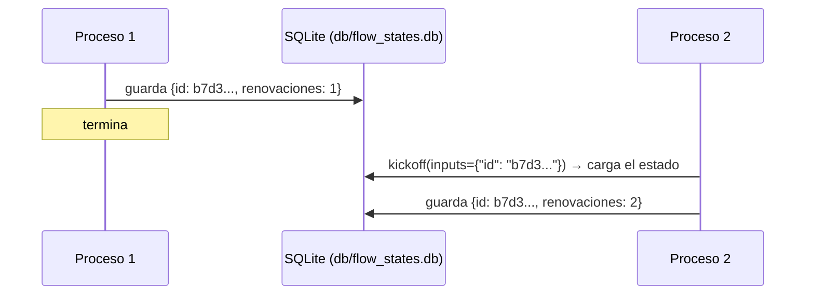

# 05 · Persistencia

> El estado de un Flow sobrevive entre ejecuciones: una suscripción que se renueva en procesos distintos, retomada por su `id`.

## Qué vas a aprender

- `@persist()` a nivel de clase.
- Retomar un Flow con `kickoff(inputs={"id": ...})`.
- Por qué el estado necesita un `id` (`FlowState`).

## Cómo funciona



## El código clave

```python
class EstadoSuscripcion(FlowState):     # FlowState trae el campo `id`
    renovaciones: int = 0
    historial: list[str] = []

@persist()                              # guarda después de cada paso (SQLite por defecto)
class FlowSuscripcion(Flow[EstadoSuscripcion]):
    @start()
    def renovar(self): ...

FlowSuscripcion().kickoff(inputs={"id": id_guardado})   # retoma
```

`@persist()` también se puede poner en un método puntual, o recibir otro backend (`persistence=...`) que implemente `FlowPersistence`.

## Correrlo

Cada comando es un proceso distinto:

```bash
uv run main.py persistencia
# id: b7d3bcc8-5f44-46b2-92cc-d943675e79ef
# renovaciones: 1

uv run main.py persistencia b7d3bcc8-5f44-46b2-92cc-d943675e79ef
# renovaciones: 2
# historial: ['renovación #1', 'renovación #2']
```

Salida real del 23/09/2026. El estado queda en `db/flow_states.db`.

## ¿Para qué sirve?

- Procesos largos que se interrumpen (un corte, un deploy) y deben continuar.
- Flujos que esperan una aprobación humana durante horas o días ([06_human_feedback](../06_human_feedback) con un proveedor asíncrono).
- Auditar cómo evolucionó el estado.

## Para experimentar

1. Abrí `db/flow_states.db` con `sqlite3` y mirá la tabla.
2. Poné `@persist()` solo en un método y compará qué se guarda.

## Tests

`tests/test_flows.py::TestPersistencia`: dos ejecuciones con el mismo id acumulan el historial.
