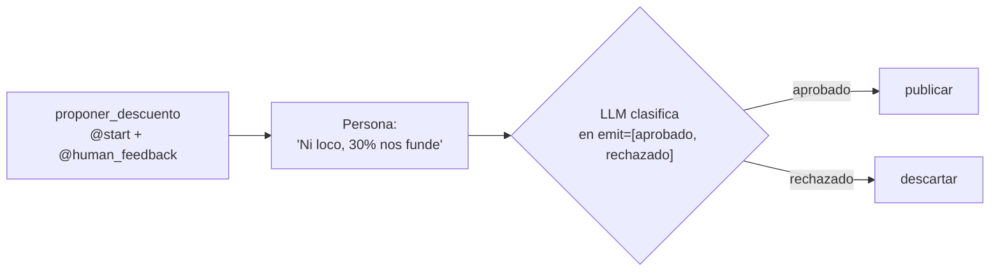

# 06 · Aprobación humana con `@human_feedback`

> Un Flow propone una promoción, una persona opina con sus palabras ("dale, publicalo" o "ni loco") y un LLM interpreta la respuesta para elegir la rama.

## Qué vas a aprender

- `@human_feedback(message=..., emit=[...], llm=...)`.
- Cómo una respuesta libre se convierte en una etiqueta de ruteo.
- Proveedores de feedback: la consola por defecto, o uno propio (Slack, web, mail).

## Cómo funciona



El método decorado se ejecuta normalmente. Después, el Flow muestra su resultado, pide la opinión y (si hay `emit`) le pide al LLM que la reduzca a una de las etiquetas. Las etiquetas funcionan igual que las de un `@router`.

## El código clave

```python
@start()
@human_feedback(
    message="¿Aprobás esta promoción?",
    emit=["aprobado", "rechazado"],
    llm=crear_llm(0.0),
    default_outcome="rechazado",      # si la respuesta viene vacía
    provider=proveedor,               # None = preguntar por consola
)
def proponer_descuento(self) -> str:
    return f"Promo: {self.state.descuento}% off en {self.state.producto}..."

@listen("aprobado")
def publicar(self, resultado: HumanFeedbackResult) -> str:
    return f"Publicada. Comentario: {resultado.feedback!r}"
```

`HumanFeedbackResult` trae `feedback` (el texto), `outcome` (la etiqueta), `output` (lo que devolvió el método) y la fecha.

## Proveedores

Un proveedor implementa `request_feedback(context, flow) -> str`. El ejemplo trae `RespuestaFija`, que responde sola, para correrlo sin teclado y en los tests. En producción podría:

- mandar un mensaje a Slack y **esperar** la respuesta (síncrono), o
- levantar `HumanFeedbackPending`: el Flow se pausa, se persiste y se retoma cuando llega la respuesta (asíncrono, con [persistencia](../05_persistencia)).

## Correrlo

```bash
uv run main.py human_feedback                                    # te pregunta en la terminal
uv run main.py human_feedback --auto "Me parece bien, publicalo"
uv run main.py human_feedback --auto "Ni loco, 30% nos funde"
```

## Qué vas a ver

Salidas reales del 23/09/2026:

```
[¿Aprobás esta promoción?]
Promo: 30% off en zapatillas running durante el fin de semana.
> Me parece bien, publicalo
=== PUBLICADA ===
Publicada. Comentario de quien aprobó: 'Me parece bien, publicalo'
```

```
> Ni loco, 30% nos funde
=== DESCARTADA ===
Descartada. Motivo: 'Ni loco, 30% nos funde'
```

## Para experimentar

1. Agregá una tercera etiqueta `"ajustar"` y un paso que baje el descuento a 20% y vuelva a preguntar.
2. Respondé algo ambiguo ("no sé, capaz") y mirá qué elige el LLM.
3. Escribí un proveedor que lea la respuesta de un archivo.

## Tests

`tests/test_flows.py::TestHumanFeedback`: las dos ramas, con `RespuestaFija` y un LLM falso como clasificador.

## Ver también

- [02_crews/07_humano_en_el_bucle](../../02_crews/07_humano_en_el_bucle): la versión simple, dentro de una tarea.
