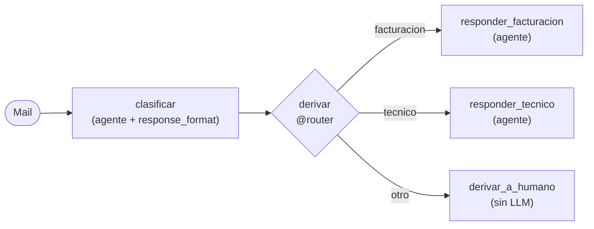

# 07 · Flow con agentes

> Una mesa de ayuda: un agente clasifica el mail, el código decide a quién derivarlo y un agente especialista responde.

## Qué vas a aprender

- Llamar agentes desde los pasos de un Flow.
- Combinar la decisión del LLM (clasificar) con el control del código (rutear).
- Por qué los pasos son `async` y usan `kickoff_async`.

## Cómo funciona



La clasificación es un objeto Pydantic con `categoria: Literal["facturacion", "tecnico", "otro"]`, así que el router recibe un valor válido y no hace falta interpretar texto.

## El código clave

```python
@start()
async def clasificar(self):
    salida = await clasificador.kickoff_async(self.state.mail, response_format=Clasificacion)
    self.state.clasificacion = salida.pydantic

@router(clasificar)
def derivar(self) -> str:
    return self.state.clasificacion.categoria
```

**Por qué `async`:** dentro de un Flow, `Agent.kickoff()` detecta el event loop y devuelve una corrutina en vez del resultado. Con `await ...kickoff_async()` queda explícito ([trampas §7](../../../docs/trampas-conocidas.md#7-agentkickoff-dentro-de-un-flow-devuelve-una-corrutina)).

## Frente a un Crew jerárquico

| | Este Flow | [Crew jerárquico](../../02_crews/02_jerarquico) |
|---|---|---|
| Quién decide a quién derivar | El código, según la categoría | El manager LLM |
| Llamadas al LLM | 2 (clasificar y responder) | Varias (el manager razona, delega y revisa) |
| Testear la derivación | Trivial | Difícil |

## Correrlo

```bash
uv run main.py flow_con_agentes "Me cobraron dos veces la cuota de septiembre"
uv run main.py flow_con_agentes "No me anda el wifi desde ayer, la luz del router está roja"
```

## Qué vas a ver

Salidas reales del 23/09/2026:

```
=== Categoría: facturacion ===
1. Reúne tu número de cliente y las fechas de los dos cargos duplicados.
2. Contacta a soporte por chat o teléfono para reportar el error específico.
...
```

```
=== Categoría: tecnico ===
1. Reinicia el router desconectándolo de la corriente 30 segundos y vuelve a conectarlo.
...
```

## Para experimentar

1. Agregá la categoría "baja" (el cliente se quiere ir) con un agente de retención.
2. Guardá cada ticket con [`@persist`](../05_persistencia).

## Tests

`tests/test_flows.py::TestFlowConAgentes`: cada categoría llega a su especialista, y "otro" no llama a ningún LLM después de clasificar.
