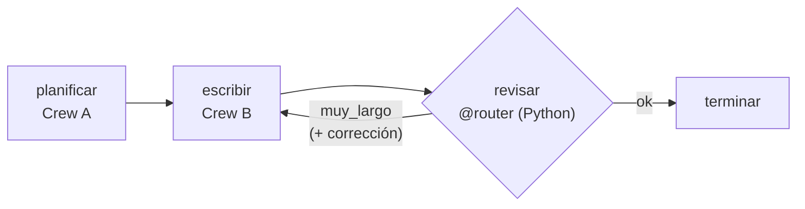

# 08 · Flow que orquesta Crews

> Un Crew planifica un artículo, otro lo escribe y el Flow verifica el largo en Python. Si se pasa, lo manda a reescribir, con un máximo de intentos.

## Qué vas a aprender

- La arquitectura recomendada: un Flow como esqueleto y Crews en las etapas.
- Un bucle de corrección con `@router` y un tope de intentos.
- Validar en código lo que un LLM mide mal.

## Cómo funciona



## El código clave

```python
@listen(or_(planificar, "muy_largo"))     # la primera vez tras planificar; después, en cada reintento
async def escribir(self):
    self.state.intentos += 1
    salida = await crew_redactor(self.state.esquema, self.state.correccion, llm).kickoff_async()
    self.state.texto = salida.raw

@router(escribir)
def revisar(self) -> str:
    palabras = contar(self.state.texto)
    if palabras <= MAX_PALABRAS or self.state.intentos >= MAX_INTENTOS:
        return "ok"
    self.state.correccion = f"Tiene {palabras} palabras; recortalo a menos de {MAX_PALABRAS}."
    return "muy_largo"
```

## Trampa: `@listen` apilados

La primera versión tenía dos decoradores:

```python
@listen("muy_largo")
@listen(planificar)
```

`kickoff()` devolvió `None`: el segundo `@listen` pisó al primero, y `escribir` nunca corrió después de planificar. La forma correcta es un solo `@listen(or_(...))` ([trampas §5](../../../docs/trampas-conocidas.md#5-apilar-listen-pierde-disparadores)).

## Correrlo

```bash
uv run main.py flow_con_crews "la historia del dulce de leche"
```

## Qué vas a ver

La salida real del 23/09/2026 (necesitó un reintento):

```
=== Artículo (114 palabras, 2 intento/s) ===
Todo empezó cocinando leche, azúcar y bicarbonato. En 1952, el chef Eduardo Curutchet perfeccionó
esta técnica, creando la receta moderna que conocemos hoy. ...
```

**Ojo con el contenido:** "Eduardo Curutchet, 1952" es un dato inventado por el modelo. El Flow controla el largo, pero nadie verifica los hechos. Para eso hace falta una fuente (búsqueda, knowledge) y un control, como en el [integrador](../../06_integrador) ([trampas §12](../../../docs/trampas-conocidas.md#12-el-llm-se-equivoca-en-datos-del-dominio)).

## Para experimentar

1. Bajá `MAX_PALABRAS` a 60 y mirá cuántos intentos necesita.
2. Agregá un tercer Crew "verificador" que marque afirmaciones dudosas.

## Tests

`tests/test_flows.py::TestFlowConCrews`: el primer artículo es demasiado largo, la corrección llega al redactor y el segundo intento se acepta.
