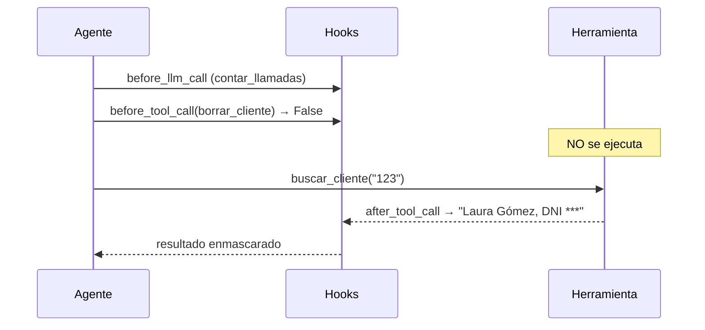

# 01 · Hooks

> Tres usos típicos: contar llamadas al LLM, bloquear una herramienta peligrosa y enmascarar un DNI antes de que el LLM lo vea.

## Qué vas a aprender

- Los cuatro puntos de enganche: antes y después de cada llamada al LLM y a cada herramienta.
- Filtrar hooks por herramienta o por agente.
- Limpiar hooks globales.

## Cómo funciona



| Hook | Recibe | Puede |
|---|---|---|
| `@before_llm_call` | `contexto.messages`, `agent`, `task`, `iterations` | Editar mensajes (en el lugar); `return False` cancela |
| `@after_llm_call` | `contexto.response` | `return "otro texto"` reemplaza la respuesta |
| `@before_tool_call` | `contexto.tool_name`, `tool_input` | Editar argumentos; `return False` bloquea |
| `@after_tool_call` | `contexto.tool_result` | `return "otro texto"` reemplaza el resultado |

## El código clave

```python
@before_tool_call(tools=["borrar_cliente"])
def bloquear_borrados(contexto):
    return False

@after_tool_call(tools=["buscar_cliente"])
def enmascarar_dni(contexto):
    return re.sub(r"DNI [\d.]+", "DNI ***", contexto.tool_result or "")

try:
    agente.kickoff(...)
finally:
    clear_all_global_hooks()     # los hooks son globales
```

## Correrlo

```bash
uv run main.py hooks
```

## Qué vas a ver

La salida real del 23/09/2026:

```
[hook] llamada #1 al LLM de 'Operador de CRM'
[hook] BLOQUEADO: borrar_cliente({'numero': '456'})
[hook] llamada #2 al LLM de 'Operador de CRM'

=== Respuesta ===
1. **Cliente 123** — Datos recuperados: Laura Gómez, DNI ***, tel. 11-5555-1234.
2. **Cliente 456** — La operación de borrado fue **bloqueada** por el sistema (hook).

Estadísticas: {'llamadas_llm': 2, 'herramientas_bloqueadas': 1}
Clientes que siguen en la base: ['123', '456']
```

El LLM nunca vio el DNI, y el cliente 456 sigue en la base.

## Para experimentar

1. Enmascará también el teléfono.
2. En vez de bloquear siempre, pedí confirmación: `contexto.request_human_input(prompt="¿Borrar?")`.
3. Con `@after_llm_call`, agregá "(respuesta generada por IA)" al final de cada respuesta.

## Tests

`tests/test_observabilidad.py::TestHooks`: el DNI no llega al LLM, el borrado no ocurre y se cuenta el bloqueo.
