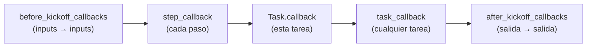

# 03 · Callbacks

> Funciones que el Crew llama en momentos puntuales: antes de arrancar, en cada paso, al terminar cada tarea y al final.

## Qué vas a aprender

- Los cinco callbacks de Crews y tareas, y en qué orden corren.
- Modificar los inputs y la salida final.
- Una trampa: `step_callback` y el ejecutor por defecto.

## Cómo funciona



| Callback | Dónde | Recibe | Puede modificar |
|---|---|---|---|
| `before_kickoff_callbacks` | Crew | `inputs` | Sí, devolviendo otros inputs |
| `step_callback` | Crew o Agent | Cada paso del agente (`AgentAction`, `AgentFinish`) | No |
| `callback` | Task | `TaskOutput` de esa tarea | No |
| `task_callback` | Crew | `TaskOutput` de cualquier tarea | No |
| `after_kickoff_callbacks` | Crew | `CrewOutput` | Sí, devolviendo la salida |

## El código clave

```python
Crew(
    agents=[chef], tasks=[receta],
    before_kickoff_callbacks=[normalizar_inputs],     # "  ZAPALLO  " → "zapallo"
    after_kickoff_callbacks=[agregar_firma],
    task_callback=lambda salida: ...,
    step_callback=lambda paso: ...,
)
```

## Trampa: `step_callback`

La primera versión nunca registró ningún `step_callback`. En 1.15 el ejecutor por defecto (`AgentExecutor`) no lo llama; solo lo hace `CrewAgentExecutor`. Por eso el chef usa `executor_class=CrewAgentExecutor` ([trampas §8](../../../docs/trampas-conocidas.md#8-step_callback-no-se-llama-con-el-ejecutor-por-defecto)).

## Correrlo

```bash
uv run main.py callbacks
```

## Qué vas a ver

La bitácora real del 23/09/2026:

```
[before_kickoff] inputs originales: {'ingrediente': '  ZAPALLO  '}
[step_callback] AgentFinish
[task.callback] receta lista (658 caracteres)
[crew.task_callback] terminó: Chef
[after_kickoff] se agregó la firma
```

## Para experimentar

1. Guardá cada receta en un archivo desde `Task.callback`.
2. Agregá una herramienta al chef y mirá los `AgentAction` en `step_callback`.

## Tests

`tests/test_observabilidad.py::TestCallbacks`: el orden de la bitácora, la normalización del input y la firma.
