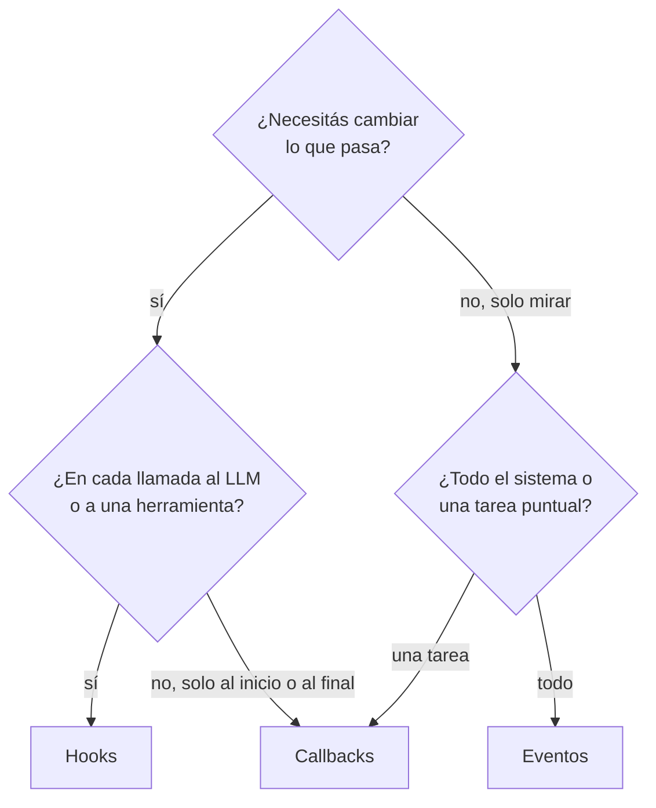

# 04 · Observabilidad

Tres formas de engancharte a lo que pasa dentro de CrewAI, del más poderoso al más simple:

| # | Ejemplo | Puede modificar la ejecución | Alcance | Ideal para |
|---|---|---|---|---|
| 01 | [hooks](01_hooks) | Sí: mensajes, respuestas y resultados; bloquear herramientas | Global, filtrable por agente o herramienta | Seguridad, enmascarar datos, aprobaciones |
| 02 | [eventos](02_eventos) | No, solo observa | Global (bus de eventos) | Logs, métricas, costos, auditoría |
| 03 | [callbacks](03_callbacks) | Inputs y salida del Crew | Un Crew o una tarea | Guardar resultados, normalizar entradas |

## ¿Cuál uso?

