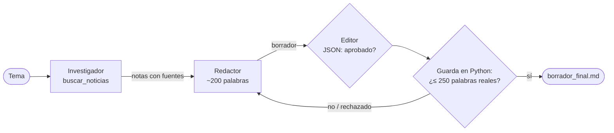

# 01 · Redactor-editor (bucle en Python)

> Un investigador busca noticias reales, un redactor escribe ~200 palabras y un editor revisa con criterios concretos. Si el editor rechaza, el redactor reescribe, hasta 3 rondas.

Es el ejemplo con el que empezó el repo. Sus decisiones técnicas (Groq, JSON como texto, la guarda de longitud) están documentadas en [docs/decisiones-tecnicas.md](../../../docs/decisiones-tecnicas.md).

## Cómo funciona



| Agente | Qué hace | Herramienta |
|---|---|---|
| Investigador | Busca noticias de la última semana y devuelve de 5 a 8 hechos con fuente | `buscar_noticias` (DuckDuckGo, sin key) |
| Redactor | Escribe el borrador usando solo las notas | — |
| Editor | Verifica los criterios y devuelve un veredicto en JSON | `contar_palabras` |

**Criterios** (constantes al inicio de `main.py`): al menos `MIN_DATOS = 2` datos concretos de las notas y no más de `MAX_PALABRAS = 250` palabras. Hasta `MAX_RONDAS = 3`.

## La guarda de longitud

Los LLM cuentan mal. En las pruebas, el editor aprobó borradores de 281, 257 y 256 palabras. Por eso `evaluar()` recalcula el conteo real y rechaza aunque el editor haya aprobado:

```python
if veredicto.aprobado and palabras > MAX_PALABRAS:
    return False, f"Conteo real: {palabras} palabras (el editor lo aprobó con un conteo erróneo)..."
```

## Correrlo

```bash
uv run main.py redactor_editor "energía solar en Argentina"
uv run main.py redactor_editor        # el investigador elige un tema tecnológico de hoy
```

Termina con código 0 si el borrador quedó aprobado y 1 si no. El resultado se guarda en `borrador_final.md` (ignorado por git).

## Qué vas a ver

La corrida real del 23/09/2026 ("energía solar en Argentina"): la guarda volvió a actuar.

```
>>> Ronda 1: borrador devuelto al redactor (256 palabras). Motivo: Conteo real: 256 palabras (el editor
lo aprobó con un conteo erróneo). El máximo es 250: recortalo a ~200.

=== Borrador final (APROBADO, 180 palabras, 2 ronda/s) ===
```

## Límites

- El editor coteja el borrador contra las **notas** del investigador, que son resúmenes del buscador. Un dato mal resumido en las notas pasa al borrador.
- El criterio de "2 datos concretos" lo juzga solo el LLM.
- `ddgs` puede fallar por límites de tasa: la herramienta devuelve el error como texto para que el agente reintente.

## Tests

`tests/test_integrador.py`: `leer_veredicto`, la guarda, y el bucle completo con LLM falso (aprobado en la primera ronda, rechazado y luego aprobado, y agotado después de 3 rondas).
