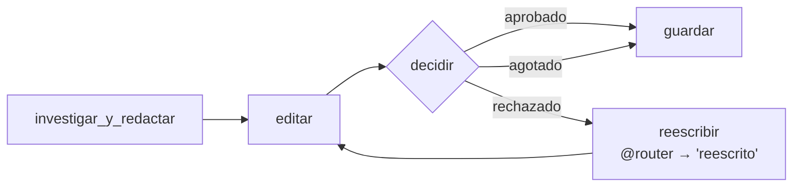

# 02 · Redactor-editor como Flow

> El mismo equipo y los mismos criterios que [01_redactor_editor](../01_redactor_editor), con el bucle expresado como un Flow.

## Comparación

| | 01 (bucle en Python) | 02 (Flow) |
|---|---|---|
| Estado | Variables locales (`notas`, `borrador`, `ronda`) | `self.state` tipado (`EstadoRedaccion`) |
| Bucle | `while not aprobado and ronda < MAX_RONDAS` | `@router` que emite `rechazado` / `aprobado` / `agotado` |
| Visualizable | No | `flow.plot()` |
| Persistible | No | Agregando `@persist()` |
| Líneas de lógica | Menos | Más, pero cada paso queda separado |

## Cómo funciona



## Trampa: el bucle y `or_`

La primera versión tenía `reescribir` como `@listen("rechazado")` y `editar` como `@listen(or_(investigar_y_redactar, reescribir))`. El test mostró que después de reescribir **nunca** se volvía a editar y el Flow terminaba con `None`: un `or_()` de métodos se dispara una sola vez por ejecución.

La solución es que `reescribir` sea un `@router` que emite `"reescrito"`, y que `editar` escuche `or_(investigar_y_redactar, "reescrito")`. Solo un router re-arma el listener ([trampas §6](../../../docs/trampas-conocidas.md#6-un-or_-de-métodos-no-se-vuelve-a-disparar-en-un-bucle)).

## Reutilización

Un nombre como `01_redactor_editor` no se puede escribir en un `import` (empieza con un número), así que el Flow lo importa con `importlib.import_module("ejemplos.06_integrador.01_redactor_editor.main")` y reusa `construir_agentes`, las tareas, `leer_veredicto` y `evaluar`.

## Correrlo

```bash
uv run main.py redactor_editor_flow "litio en Argentina"
```

> Verificado **solo offline**. Las corridas en vivo del 23/09/2026 alcanzaron el límite diario de Groq (200.000 tokens) antes de terminar ([trampas §11](../../../docs/trampas-conocidas.md#11-límites-de-groq-entrada-por-minuto-413-y-tokens-por-día-429)). El test recorre una ronda de rechazo y una de aprobación con un LLM falso.

## Tests

`tests/test_integrador.py::TestRedactorEditorFlow`.
