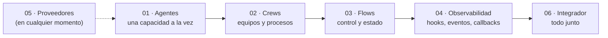

# Ejemplos

Treinta y cuatro ejemplos, uno por cada tipo de cosa que se puede armar con CrewAI: 33 ejecutables y 1 solo documentado. Cada carpeta tiene su `main.py` (código comentado para aprender) y su `README.md` (qué muestra, cómo funciona, salida real y ejercicios).

## Cómo correrlos

Desde la raíz del repo:

```bash
uv run main.py                         # lista todos los ejemplos
uv run main.py agente_solo             # corre el que coincide con "agente_solo"
uv run main.py redactor_editor "tema"  # los argumentos extra van al ejemplo
```

El lanzador busca por cualquier parte del camino (`flows/03_router`, `jerarquico`...). Si hay varias coincidencias, te las lista. Equivale a:

```bash
uv run -m ejemplos.01_agentes.01_agente_solo.main
```

## Recorrido sugerido



## Catálogo

### [01 · Agentes](01_agentes)

| Ejemplo | Muestra | Requiere |
|---|---|---|
| [01_agente_solo](01_agentes/01_agente_solo) | `Agent.kickoff()` sin Crew, `response_format` | LLM |
| [02_herramientas](01_agentes/02_herramientas) | `@tool`, `BaseTool`, `ToolFailure` | LLM |
| [03_mcp](01_agentes/03_mcp) | Herramientas desde un servidor MCP local | LLM |
| [04_knowledge](01_agentes/04_knowledge) | RAG con documentos propios | LLM + embeddings |
| [05_memoria](01_agentes/05_memoria) | Recordar entre ejecuciones | LLM + embeddings |
| [06_planificacion](01_agentes/06_planificacion) | `planning_config` | LLM |
| [07_guardrails](01_agentes/07_guardrails) | Validación y autocorrección | LLM |
| [08_salida_estructurada](01_agentes/08_salida_estructurada) | `output_pydantic` y JSON validado | LLM |
| [09_ejecucion_de_codigo](01_agentes/09_ejecucion_de_codigo) | Sandbox con Docker | LLM + Docker |
| [10_a2a](01_agentes/10_a2a) | Delegar en un agente remoto | LLM + `crewai[a2a]` |
| [11_multimodal](01_agentes/11_multimodal) | Imágenes y PDFs (solo documentado) | Modelo con visión |

### [02 · Crews](02_crews)

| Ejemplo | Muestra |
|---|---|
| [01_secuencial](02_crews/01_secuencial) | Proceso secuencial y `context` |
| [02_jerarquico](02_crews/02_jerarquico) | Manager que delega (`manager_llm`, `manager_agent`) |
| [03_delegacion](02_crews/03_delegacion) | `allow_delegation` |
| [04_tareas_condicionales](02_crews/04_tareas_condicionales) | `ConditionalTask` |
| [05_tareas_asincronas](02_crews/05_tareas_asincronas) | `async_execution` |
| [06_planificacion](02_crews/06_planificacion) | `Crew(planning=True)` |
| [07_humano_en_el_bucle](02_crews/07_humano_en_el_bucle) | `human_input=True` |
| [08_proyecto_yaml](02_crews/08_proyecto_yaml) | `@CrewBase` con YAML |
| [09_ejecucion_multiple](02_crews/09_ejecucion_multiple) | `inputs`, `kickoff_for_each`, `kickoff_async` |

### [03 · Flows](03_flows)

| Ejemplo | Muestra | LLM |
|---|---|---|
| [01_basico](03_flows/01_basico) | `@start`, `@listen` | No |
| [02_estado](03_flows/02_estado) | Estado dict y Pydantic | No |
| [03_router](03_flows/03_router) | `@router` | No |
| [04_paralelo_and_or](03_flows/04_paralelo_and_or) | Paralelismo, `and_`, `or_` | No |
| [05_persistencia](03_flows/05_persistencia) | `@persist` | No |
| [06_human_feedback](03_flows/06_human_feedback) | `@human_feedback` | Sí |
| [07_flow_con_agentes](03_flows/07_flow_con_agentes) | Agentes en los pasos | Sí |
| [08_flow_con_crews](03_flows/08_flow_con_crews) | Crews en los pasos, bucle de corrección | Sí |

### [04 · Observabilidad](04_observabilidad)

| Ejemplo | Muestra |
|---|---|
| [01_hooks](04_observabilidad/01_hooks) | Interceptar y modificar llamadas al LLM y a herramientas |
| [02_eventos](04_observabilidad/02_eventos) | Escuchar el bus de eventos |
| [03_callbacks](04_observabilidad/03_callbacks) | Callbacks de Crew y de tarea |

### [05 · Proveedores de LLM](05_proveedores_llm)

| Ejemplo | Muestra |
|---|---|
| [01_comparar_proveedores](05_proveedores_llm/01_comparar_proveedores) | El mismo agente en Groq, LM Studio, Ollama, OpenAI, Anthropic y Gemini |

### [06 · Integrador](06_integrador)

| Ejemplo | Muestra |
|---|---|
| [01_redactor_editor](06_integrador/01_redactor_editor) | Crew con búsqueda web real y bucle de revisión en Python |
| [02_redactor_editor_flow](06_integrador/02_redactor_editor_flow) | El mismo caso como Flow |

## Estado de verificación

Todos los ejemplos ejecutables tienen tests offline que pasan (`uv run python -m unittest -b`, ver [docs/tests.md](../docs/tests.md)). Además, la mayoría se corrió en vivo con Groq (`qwen/qwen3.8-27b`) entre el 21 y el 23/09/2026. Las salidas de los README son de esas corridas.

| Estado | Ejemplos |
|---|---|
| ✅ Corrido en vivo | 01_agentes: 01 a 09 · 02_crews: 01, 03, 04 (las dos ramas), 08 · 03_flows: 01 a 08 · 04_observabilidad: 01 a 03 · 05_proveedores_llm/01 (solo Groq) · 06_integrador/01 (`APROBADO`, código de salida 0) |
| ⚠️ En vivo, con observaciones | 02_crews/02_jerarquico: la delegación funcionó, pero el contador calculó mal y una corrida chocó con el límite de 7000 tokens de entrada por minuto de Groq. La versión corregida (regla del SAC en la historia del contador) no se volvió a correr |
| 🧪 Solo offline | 02_crews: 05, 06, 07 (interactivo), 09 · 06_integrador/02: se alcanzó el límite diario de Groq (200.000 tokens) antes de correrlos |
| ❌ No ejecutable en el entorno del repo | 01_agentes/10_a2a (falta `crewai[a2a]`, sin acceso a PyPI) · 01_agentes/11_multimodal (sin modelo con visión; solo documentado) |

Los problemas que aparecieron en esas corridas, y cómo se resolvieron, están en [docs/trampas-conocidas.md](../docs/trampas-conocidas.md).

## Convenciones de los ejemplos

- **Un `main.py` por carpeta**, con una docstring que explica el concepto y cómo correrlo.
- **El LLM se puede inyectar:** `construir_agente(llm=None)` / `construir_crew(..., llm=None)`. Si no se pasa, se usa `crear_llm(...)`. Así los tests usan un LLM falso.
- **`main()` devuelve un código de salida** (0 = bien).
- **Todo en español**, con voseo en los prompts.
- **Comentarios didácticos**: a diferencia del código de producción, acá los comentarios explican conceptos, no solo decisiones raras.
